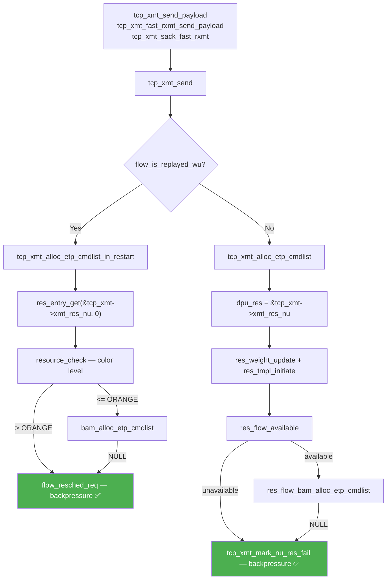
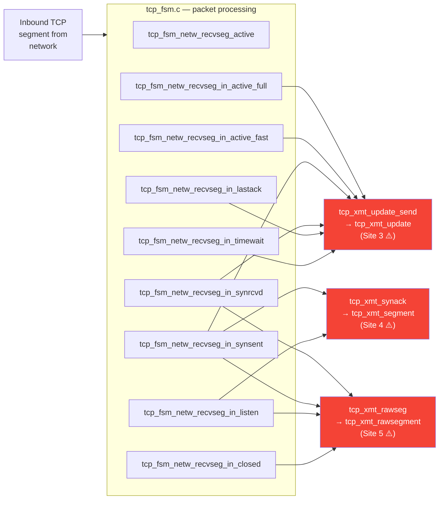
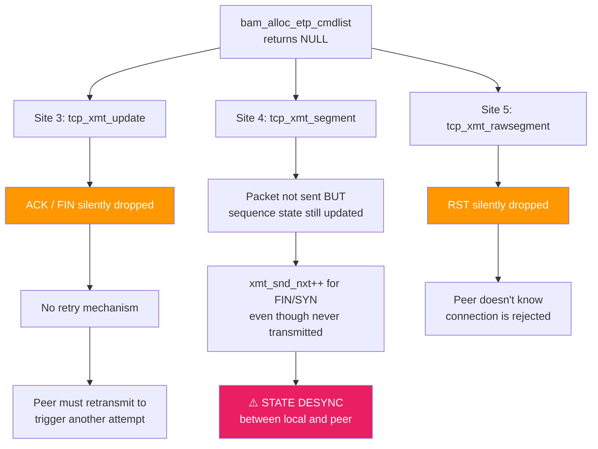
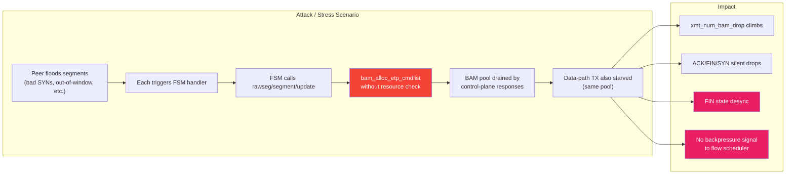

# BAM ETP Cmdlist Allocation — Resource Check Gap Analysis

**ADO**: [2568748](https://azurecsi.visualstudio.com/Dev/_workitems/edit/2568748)
**File under analysis**: `networking/tcpip/tcp_xmt.c`
**Date**: 2026-04-12

---

## 1. Executive Summary

There are **5 call sites** in `tcp_xmt.c` that allocate BAM ETP cmdlists (via
`bam_alloc_etp_cmdlist()` or `res_flow_bam_alloc_etp_cmdlist()`). Only **2** of
them perform a resource availability check using `tcp_xmt->xmt_res_nu` before
allocating. The remaining **3** allocate directly from the BAM pool without any
resource-level gating.

All 3 unchecked sites are reachable from **inbound network packets** via the TCP
FSM, meaning a misbehaving or malicious peer can trigger BAM pool exhaustion
without any flow-based backpressure.

When allocation fails, control packets (ACK, FIN, SYN, RST) are **silently
dropped** with no retry. In one case (`tcp_xmt_segment` for FIN), internal
sequence state advances even though the packet was never transmitted, creating a
**state desync**.

---

## 2. Call Sites Overview

| # | Function | Line | Alloc API | `xmt_res_nu` check | Packet type |
|---|----------|------|-----------|---------------------|-------------|
| 1 | `tcp_xmt_alloc_etp_cmdlist_in_restart` | 1558 | `bam_alloc_etp_cmdlist` | ✅ Yes | Data TX (restart) |
| 2 | `tcp_xmt_alloc_etp_cmdlist` | 1596 | `res_flow_bam_alloc_etp_cmdlist` | ✅ Yes | Data TX (normal) |
| 3 | `tcp_xmt_update` | 2601 | `bam_alloc_etp_cmdlist` | ⚠️ **No** | Force ACK / FIN |
| 4 | `tcp_xmt_segment` | 2704 | `bam_alloc_etp_cmdlist` | ⚠️ **No** | SYN / SYN-ACK / FIN / RST / Probe |
| 5 | `tcp_xmt_rawsegment` | 2978 | `bam_alloc_etp_cmdlist` | ⚠️ **No** | Raw RST |

---

## 3. Resource-Checked Paths (Sites 1 & 2)

These are the **data transmit** paths invoked from `tcp_xmt_send()`. Both check
`xmt_res_nu` before attempting BAM allocation and integrate with the flow
scheduler for backpressure.



**Key properties:**
- Resource check gates allocation — pool exhaustion is caught early
- On failure: `flow_resched_req()` or `tcp_xmt_mark_nu_res_fail()` triggers
  backpressure so the flow is rescheduled when resources free up
- No silent drops — the flow scheduler retries later

---

## 4. Unchecked Paths (Sites 3, 4, 5)

These are **control-plane packet** paths. They call `bam_alloc_etp_cmdlist()`
directly without consulting `xmt_res_nu`.

```mermaid
flowchart TD
    subgraph "Site 3 — tcp_xmt_update  (line 2601)"
        U1[tcp_xmt_update_send] --> U2[tcp_xmt_update]
        U2 --> U3{"force ACK / FIN / send_fin?"}
        U3 -- Yes --> U4["bam_alloc_etp_cmdlist(THIS_MODULE)<br/>⚠️ NO xmt_res_nu check"]
        U4 -- NULL --> U5["TCP_XMT_STATS_INC_STAT(xmt_num_bam_drop)<br/>return — silently dropped"]
    end

    subgraph "Site 4 — tcp_xmt_segment  (line 2704)"
        S1["tcp_xmt_fin / tcp_xmt_probe /<br/>tcp_xmt_rst / tcp_xmt_syn /<br/>tcp_xmt_synack"] --> S2[tcp_xmt_segment]
        S2 --> S3["bam_alloc_etp_cmdlist(THIS_MODULE)<br/>⚠️ NO xmt_res_nu check"]
        S3 -- NULL --> S4["TCP_XMT_STATS_INC_STAT(xmt_num_bam_drop)<br/>sequence state still updated!"]
    end

    subgraph "Site 5 — tcp_xmt_rawsegment  (line 2978)"
        R1[tcp_xmt_rawseg] --> R2[tcp_xmt_rawsegment]
        R2 --> R3["bam_alloc_etp_cmdlist(THIS_MODULE)<br/>⚠️ NO xmt_res_nu check"]
        R3 -- NULL --> R4["TCP_XMT_STATS_INC_STAT(xmt_num_bam_drop)<br/>return — silently dropped"]
    end

    style U4 fill:#f44336,color:#fff
    style S3 fill:#f44336,color:#fff
    style R3 fill:#f44336,color:#fff
    style U5 fill:#ff9800,color:#fff
    style S4 fill:#e91e63,color:#fff
    style R4 fill:#ff9800,color:#fff
```



---

## 5. Network Packet to Unchecked Allocation — Full Call Chains

All 3 unchecked sites are reachable from TCP FSM handlers that process inbound
network segments.



### Detailed caller list per site

#### Site 3 — `tcp_xmt_update()` via `tcp_xmt_update_send()`
All from `tcp_fsm.c`, all processing **received packets**:

| FSM handler | TCP state | Trigger |
|---|---|---|
| `tcp_fsm_netw_recvseg_in_active_full` | ESTABLISHED | ACK/data received |
| `tcp_fsm_netw_recvseg_in_active_fast` | ESTABLISHED | Fast-path ACK |
| `tcp_fsm_netw_recvseg_in_synsent` | SYN_SENT | SYN-ACK received |
| `tcp_fsm_netw_recvseg_in_synrcvd` | SYN_RCVD | ACK completing 3WHS |
| `tcp_fsm_netw_recvseg_in_lastack` | LAST_ACK | ACK for FIN |
| `tcp_fsm_netw_recvseg_in_timewait` | TIME_WAIT | Segment in TIME_WAIT |

#### Site 4 — `tcp_xmt_segment()` via wrapper functions

| Wrapper | Via | Trigger |
|---|---|---|
| `tcp_xmt_synack` | `recvseg_in_listen`, `recvseg_in_synsent` | Received SYN → send SYN-ACK |
| `tcp_xmt_syn` | Timer retransmit | SYN retransmit |
| `tcp_xmt_fin` | Host close | FIN send |
| `tcp_xmt_rst` | Abort path | RST send |
| `tcp_xmt_probe` | Timer | Keepalive / persist probe |

#### Site 5 — `tcp_xmt_rawsegment()` via `tcp_xmt_rawseg()`
All from `tcp_fsm.c`, all responding to **received packets**:

| FSM handler | Reason |
|---|---|
| `recvseg_in_listen` | RST for unexpected ACK |
| `recvseg_in_synsent` | RST for bad SYN-ACK / unexpected ACK |
| `recvseg_in_synrcvd` | RST for bad ACK/SYN |
| `recvseg_in_closed` | RST for any segment on closed socket |

---

## 6. Failure Behavior Analysis



### Detailed failure consequences

| Site | Packet lost | State mutation on failure | Recovery mechanism | Severity |
|------|-------------|--------------------------|-------------------|----------|
| 3 — `tcp_xmt_update` | ACK or FIN | None — clean `return` | Peer retransmit triggers new attempt | Medium |
| 4 — `tcp_xmt_segment` (FIN) | FIN | **`xmt_snd_nxt++`, `xmt_snd_max` updated** | Timer retransmit may send, but state already advanced | **High** |
| 4 — `tcp_xmt_segment` (SYN) | SYN | `xmt_snd_nxt++`, `xmt_snd_max` updated | SYN retransmit timer | Medium |
| 4 — `tcp_xmt_segment` (RST) | RST | `xmt_th_flag_rst = 1` set | None — RST lost forever | Medium |
| 4 — `tcp_xmt_segment` (Probe) | Keepalive | None — probe has no sequence effect | Next timer fires | Low |
| 5 — `tcp_xmt_rawsegment` | RST | None — clean `return` | None — reactive RST lost | Low |

### Site 4 FIN state desync — code path

```c
// tcp_xmt_segment(), line 2704
bam_start = bam = bam_alloc_etp_cmdlist(THIS_MODULE);
// bam is NULL here

if (!bam) {
    TCP_XMT_STATS_INC_STAT(tcp_xmt, xmt_num_bam_drop);
    // does NOT return — falls through to switch
}

// ...
case TH_ACK | TH_FIN:
    tcp_xmt->xmt_th_flag_fin = th_flags;  // ← state set
    tcp_xmt->xmt_snd_fin = sndend;        // ← state set

    if (bam) {
        // skipped — bam is NULL
    }

    tcp_xmt->xmt_snd_nxt++;               // ← ADVANCED even though FIN not sent!
    if (SEQ_GT(tcp_xmt->xmt_snd_nxt, tcp_xmt->xmt_snd_max)) {
        tcp_xmt->xmt_snd_max = tcp_xmt->xmt_snd_nxt;  // ← ADVANCED
    }
    break;
```

The FIN occupies one sequence number. When `bam` is NULL, the sequence counters
still advance past the FIN, but the peer never received it. Subsequent
retransmits (if any) may use the wrong sequence number.

---

## 7. Correlation: `xmt_num_bam_drop` Stat

`xmt_num_bam_drop` is incremented **only** at the 3 unchecked sites. It is
classified as an "exceptional" stat (printed at flow teardown):

```c
// tcp_stats.h
#define tcp_xmt_stats_exceptional_list(__stat)
    __stat(xmt_num_rxmt)
    __stat(xmt_num_bam_drop)
```

When this counter is non-zero, it confirms BAM ETP pool exhaustion affected
control packets. Since the data-path (Sites 1 & 2) uses the **same BAM pool**
but has resource checks with backpressure, a high `xmt_num_bam_drop` strongly
correlates with heavy data-path TX activity draining the pool, with control
packets as collateral.

---

## 8. Comparison: RDMA Path

For reference, the RDMA subsystem (`roce_rc.c:2604`) also allocates ETP
cmdlists but **does** perform a resource check first:

```c
// roce_rc.c
res_init(&dpu_res);
res_check_bam(&dpu_res, BAM_ETP_CMDLIST_POOL_OF_PC(...), ...);
res_initiate(&dpu_res);

if (!res_flow_available(&dpu_res, hton_f, false, NULL)) {  // ← CHECK ✅
    // reschedule
    return NULL;
}
faereq = res_flow_bam_alloc_etp_cmdlist(&dpu_res, hton_f);
```

This shows the `res` framework is usable even for non-`tcp_xmt` allocations,
and the TCP control-plane paths could potentially adopt a similar pattern.

---

## 9. Risk Summary



### Key risks

1. **No backpressure**: unchecked paths don't call `flow_resched_req()` or
   `tcp_xmt_mark_nu_res_fail()`, so the flow scheduler has no visibility into
   the exhaustion
2. **State desync**: `tcp_xmt_segment()` advances sequence numbers on FIN/SYN
   even when the packet is not sent
3. **Network-triggerable**: all 3 unchecked paths are reachable from inbound
   packets — an external entity can force allocations
4. **Silent failure**: only a per-flow stat counter (`xmt_num_bam_drop`) records
   the drop — no log, no alert, no reschedule
