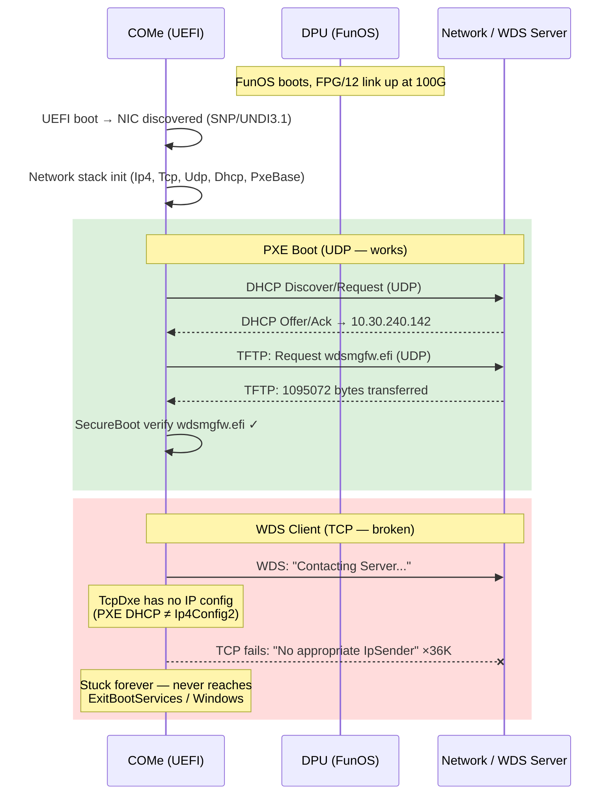
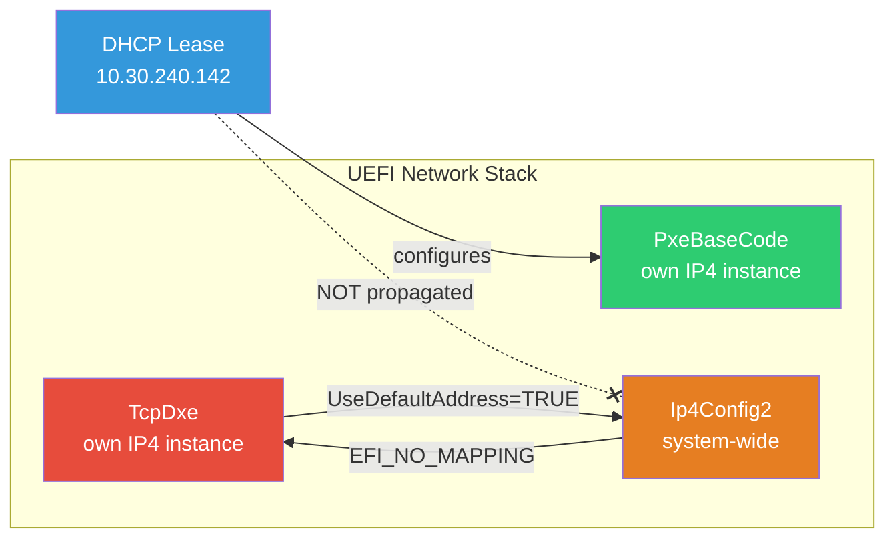

# ADO 3088420 — COMe not reachable after PXE boot

## Bug Summary
- **Title**: [S21F1]: COMe not reachable after PXE boot. See "TcpSendIpPacket: No appropriate IpSender" in SAC console
- **State**: Active | **Severity**: 2 - High | **Priority**: 2
- **Assigned To**: Suresh Kumar Nedunchezhian
- **Area**: S21F1 → SW-NW → NW-CORE
- **Created**: 2025-10-28 | **FunSDK**: 24544
- **Tags**: PostPV_Eng, S21F1-PXE, S21F1-Bundle-Sanity, S21F1-DC-4 through DC-7 Caveat

## Symptom
After PXE boot with FunSDK 24544, the COMe (RDP at 10.30.240.142) becomes unreachable. The UEFI serial console is flooded with:
```
[TcpDxe]: TcpSendIpPacket: No appropriate IpSender.
[TcpDxe]: TcpInput: Discard a packet
```

## Logs Analyzed
| Log | Source | Key Content |
|-----|--------|-------------|
| `come_log.txt` (4.9MB, 98K lines) | COMe UEFI serial | PXE boot, TCP drops, WDS screen |
| `bmc_come_log.txt` (7.9MB, 169K lines) | COMe UEFI serial (different boot) | Two PXE attempts, PXE-E18 timeout |
| `funos_log.txt` (2.3MB) | FunOS/DPU UART | DPU boot, network init, link status |
| BMC log bundles (bmc_logs_9, bmc_logs_12) | BMC | IPMI, no dpcsh stats |

## Timeline (from come_log.txt)



## Root Cause Dataflow



1. **UEFI boot** → NIC discovered: SNP/UNDI3.1 on MAC `7C-C0-AA-53-B0-7B` (line 20181)
2. **Network stack init** → Ip4Dxe, TcpDxe, Udp4Dxe, Dhcp4Dxe, PxeBaseCode all start (lines 20200-20234)
3. **PXE boot begins** → "Start PXE over IPv4 on MAC: 7C-C0-AA-53-B0-7B" (line 22206)
4. **TCP drops begin immediately** → line 22212, before DHCP even completes
5. **DHCP succeeds (UDP)** → Station IP: `10.30.240.142`, Server: `10.30.240.8` (line 22437)
6. **NBP identified** → `boot\x64\wdsmgfw.efi`, 1095072 bytes (line 24636)
7. **NBP download starts** → "Downloading NBP file..." via TFTP/UDP (line 24642)
8. **SecureBoot verification** → wdsmgfw.efi passes PKCS7/Authenticode check (lines 72376-72606)
9. **WDS client launches** → "Windows Deployment Services (Server IP: 10.30.240.8) ESC=Exit" (line 78337)
10. **Stuck forever** → No progress after "Contacting Server". Remaining ~20K lines are all TCP drops.
11. **Never reaches ExitBootServices** → Windows never boots, RDP never comes up.

## Key Findings

### 1. TCP Drops Are Background Network Noise
- **36,032** `TcpSendIpPacket: No appropriate IpSender` messages
- **36,928** `TcpInput: Discard a packet` messages
- Drop rate is **constant ~48-50%** of log lines throughout — not correlated with WDS activity
- These are incoming TCP packets from the network hitting an unconfigured TCP stack
- The UEFI TcpDxe stack logs every single one to serial console

### 2. Why TCP Stack Is Unconfigured
- UEFI network stack creates **per-driver IP4 instances** — they don't share configuration
- PxeBaseCode configures its own IP4 children with DHCP-assigned address → DHCP/TFTP/UDP work fine
- TcpDxe's IP4 instance (`0x5BF85020`) is **never configured** because:
  - PXE DHCP does NOT propagate the lease to the system-wide `Ip4Config2`
  - When an application calls `Tcp4->Configure()` with `UseDefaultAddress=TRUE`, it queries `Ip4Config2`
  - `Ip4Config2` has no address → `EFI_NO_MAPPING` → TCP configuration fails
- This is **by design** in EDK2 — PxeBaseCode operates independently

### 3. PXE-E18: Server Response Timeout (found in bmc_come_log)
- `bmc_come_log.txt` shows **two PXE boot attempts**
- First attempt: NBP download via TFTP times out → `PXE-E18: Server response timeout` → `ERROR: Boot option loading failed`
- Second attempt: NBP downloads successfully, wdsmgfw.efi loads, but WDS stuck at "Contacting Server"
- The PXE-E18 is a **TFTP (UDP) timeout** — the WDS server didn't respond to TFTP data transfer in time

### 4. DHCP Options
- DHCP response shows Station IP and Server IP but the log does not display subnet mask or gateway
- However, this is **normal UEFI PXE console behavior** — it only prints Station IP, Server IP, and NBP filename
- Subnet mask (Option 1) and Gateway (Option 3) come in the same DHCP packet and are likely present but not displayed

### 5. FunOS / DPU Side
- FunOS boots normally on the DPU
- **Only FPG/12 link comes up** at 100G — other FPG ports remain down
- PSW port speed configured for ports 0, 4, 8, 12
- `ERR network_unit "HNU PSW Config Parsing Failed!"` — noted but assessed as not the root cause
- `ERR network_unit "FCP mem init failed"` — also present
- **No NU periodic stats** — disabled ("no bootarg provided")
- **No dpcsh scripts** — `init.dpcsh` and `early.dpcsh` do not exist
- **No packet counters (vppkts, PSW drops, FPG stats) available** in any of the logs

### 6. No Timestamps in UEFI Log
- The COMe serial log has **no timestamps** — cannot determine exact wall-clock duration of TCP drops
- Baud rate estimate: ~4.9MB at 115200 baud = minimum ~7 minutes of serial output
- TCP drop messages account for ~3.6MB = ~5.2 minutes of serial I/O (lower bound)
- Test harness polled RDP for ~4.6 minutes (14:10:48 to 14:15:24) before giving up

## Root Cause Assessment

The system fails at the WDS "Contacting Server" phase. Two contributing factors:

1. **Intermittent UDP/TFTP reliability**: First PXE attempt fails with PXE-E18 (TFTP server response timeout). Second attempt's NBP download succeeds but WDS later stalls. This suggests unreliable packet delivery on the COMe→DPU→FPG/12→network path.

2. **TCP completely non-functional**: The UEFI TCP stack cannot be configured because PXE DHCP doesn't propagate to Ip4Config2. If WDS requires TCP/HTTP for image transfer (modern WDS does), it will fail. The 36K+ TCP drop messages are from unsolicited background network traffic flooding the unconfigured TCP stack.

## Open Questions

1. **Is the COMe→DPU datapath dropping UDP packets?** — No DPU-side counters available to verify. Need vppkts/PSW/FPG stats during repro.
2. **Does WDS use TCP or UDP for image transfer?** — Modern WDS can use either TFTP (UDP) or HTTP (TCP). The protocol in use determines whether the TCP issue is relevant.
3. **Why is there so much incoming TCP traffic?** — The network environment may have broadcast storms, port scans, or other hosts sending traffic to the COMe's IP/MAC.
4. **Is the PXE-E18 on first attempt a timing issue or a real packet loss?** — Could be DPU not ready, FPG/12 link not up yet, or actual packet drops.

## Recommendations for Next Steps

1. **Reproduce with DPU packet counters enabled**: Add `--nu-periodic-stats` bootarg and/or a dpcsh script to collect FPG/PSW/vppkt counters during PXE boot
2. **Capture network traffic**: TCPdump on the WDS server side to see if TFTP/WDS packets from the COMe are arriving and responses are being sent
3. **Check DPU forwarding rules**: Verify the MANA NIC virtual interface for the COMe is properly forwarding packets in both directions
4. **Test with network isolation**: Try PXE boot with minimal network traffic to rule out the TCP flood as a contributing factor
