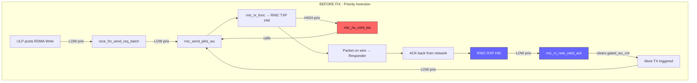
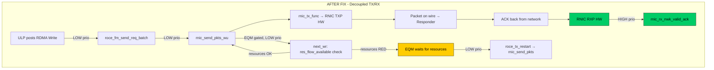
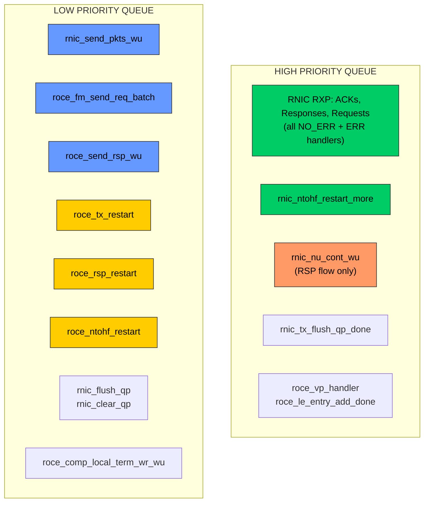
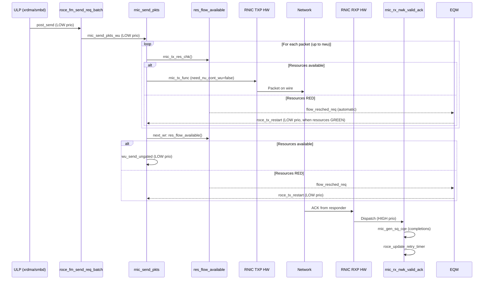

# RDMA VP Priority Analysis & TX/RX Decoupling Fix

**ADO 3383627** | Branch: `suresh/rdma_fc` | Commit: `ea3e1915b1e`

## Problem Statement

At 11Mpps RDMA writes with 1KB PTMU, the sender generates ~11Mpps ACKs returning from the responder. All 64 VPs are saturated. BAM builds up, flow controls back to ERP → PSW → PFC.

**VP profiling shows the bottleneck:**
```
rnic_nu_cont_wu:                          count=165,797  avg=1.76us  (TX continuation - HIGH prio)
WU_RNIC_RX_RESPONSE_NO_ERR_BASE1 (ACK):  count=165,811  avg=1.57us  (ACK processing - was LOW prio)
rnic_send_pkts_wu:                        count=124,352  avg=738ns   (TX packet build - LOW prio)
roce_fm_send_req_batch:                   count=41,452   avg=5.77us  (ULP post_send - LOW prio)
```

~50 WUs sitting in low priority queue, no buildup in high priority queue.

## Root Cause



**Three problems:**
1. **ACKs on LOW priority** — RNIC RXP dispatches to `sq_vp` which is LOW priority (`faddr_vp_to_low_priority()` at `roce_qp.c:865`). ACKs compete with TX work.
2. **TX continuation on HIGH priority** — `rnic_nu_cont_wu` dispatched to `faddr_vp_to_high_priority(xmt_vp)` (`rnic_tx.c:1274`). Starves ACK processing.
3. **No TX backpressure** — At `next_wr`, bare `wu_send_ungated` generates unlimited TX work with no resource gating.

**Positive feedback loop:** TX generates packets → ACKs return but starved by HIGH prio TX continuations → BAM fills → ERP flow control → PSW → PFC.

## Fix



### Change 1: ACK RX → HIGH Priority
**File:** `roce_qp.c:611-613, 672-674`

Program `faddr_vp_to_high_priority(sq_vp)` into RNIC QP context via `hw_rnic_qp_trans_rts()` and `hw_rnic_qp_trans_reset()`. All RNIC RXP-dispatched WUs (ACKs, read responses, requests, errors) now land on HIGH priority queue.

### Change 2: Eliminate `rnic_nu_cont_wu` for TX Request Path
**File:** `rnic_tx.c:1976`

Set `need_nu_cont_wu = false` for TX request packets. The `next_wr` dispatch already provides TX continuation — the NU continuation WU was redundant. Removes ~165K HIGH priority WUs/sec per VP. RSP flow (read-response) retains the continuation.

### Change 3: EQM-Gated TX Restart at `next_wr`
**File:** `rnic_tx.c:2005-2018`

Add `res_flow_available()` check at `next_wr` (gated on `enable_tx_restart_via_eqm` modcfg). When NU DMA resources are constrained, the flow is registered with EQM for restart via `roce_tx_restart`. This provides VP-level backpressure instead of unbounded `wu_send_ungated`.

The `res_fail` path (resource exhaustion during packet build) already has EQM restart built in — `res_flow_available()` inside `rnic_tx_res_chk()` calls `flow_resched_req()` when resources are RED.

## VP Priority Map

### RNIC Mode (HW Offload)



| WU Handler | Priority | Path | Dispatch Mechanism |
|---|---|---|---|
| **RNIC RXP: all NO_ERR handlers** (ACK, read resp, send/write req, CNP, etc.) | **HIGH** | RX | RNIC HW → `faddr_vp_to_high_priority(sq_vp)` in QP context |
| **RNIC RXP: all ERR handlers** (unexpected PSN, NAK, size violation, etc.) | **HIGH** | RX | RNIC HW → same QP context VP |
| `rnic_nu_cont_wu` | **HIGH** | TX RSP | NU DMA completion (RSP flow only after fix) |
| `rnic_ntohf_restart_more` | **HIGH** | RX restart | `faddr_vp_to_high_priority(xmt_vp)` |
| `rnic_tx_flush_qp_done` | **HIGH** | Control | NU DMA continuation |
| `roce_vp_handler` | **HIGH** | Admin | MR deregister |
| `roce_le_entry_add_done` | **HIGH** | Admin | Modify key |
| `rnic_send_pkts_wu` | **LOW** | TX | `RNIC_CALL_SEND_PKTS` → `xmt_vp` |
| `roce_fm_send_req_batch` | **LOW** | TX | ULP channel push |
| `roce_send_rsp_wu` | **LOW** | TX RSP | Read response dispatch |
| `roce_tx_restart` | **LOW** | EQM | Flow restart framework |
| `roce_rsp_restart` | **LOW** | EQM | RSP flow restart |
| `roce_ntohf_restart` | **LOW** | EQM | ntoh flow restart |
| `rnic_flush_qp` | **LOW** | Control | QP flush initiation |
| `rnic_clear_qp` | **LOW** | Control | QP clear |
| `roce_comp_local_term_wr_wu` | **LOW** | TX | Local termination |

### SW RoCE Mode (No RNIC HW)

| WU Handler | Priority | Path | Dispatch Mechanism |
|---|---|---|---|
| `roce_nu_cont_wu` | **HIGH** | TX cont | NU DMA completion → `faddr_vp_to_high_priority(xmt_vp)` |
| `roce_ntohf_restart_more` | **HIGH** | RX restart | `faddr_vp_to_high_priority(xmt_vp)` |
| `roce_vp_handler` | **HIGH** | Admin | MR deregister |
| `roce_le_entry_add_done` | **HIGH** | Admin | Modify key |
| `roce_send_pkts_wu` | **LOW** | TX | TX dispatch → `xmt_vp` |
| `roce_send_rsp_wu` | **LOW** | TX RSP | Read response dispatch |
| `roce_tx_restart` | **LOW** | EQM | Flow restart framework |
| `roce_rsp_restart` | **LOW** | EQM | RSP flow restart |
| `roce_ntohf_restart` | **LOW** | EQM | ntoh flow restart |
| `roce_fm_send_req_batch` | **LOW** | TX | ULP post_send |
| `roce_comp_local_term_wr_wu` | **LOW** | TX | Local termination |
| RX packet handlers (RC/UD) | **LOW** | RX | NU ERP→LE→VP at `xmt_vp` (LOW) |

**Key difference:** In SW RoCE, RX packets arrive via LE at LOW priority (flow destination = `xmt_vp`). `roce_nu_cont_wu` (TX continuation) is the main HIGH priority WU — creating a similar priority concern as the original RNIC bug, but in the opposite direction.

## TX Flow Diagram (RNIC Mode — After Fix)



## Validation Results

| Test | Target | Result |
|---|---|---|
| POSIX build + write_bw | f1d1-posix | ✅ Clean exit |
| POSIX build + write_bw | f2-posix | ✅ Clean exit |
| FoD write_bw loopback | S21F2-XIO (job 5816881) | ✅ **268 Gbps** |

**FoD details:** 4 QPs, 256KB IO size, 30s runtime, `send_depth=16`
- Client: 3,842,068 IOs, 128K IOPS, **268.56 Gbps**
- All 4 connections completed, 0 failures
- `RNIC_tx_nu_dma_fails: 11,422,821` — confirms EQM backpressure is actively throttling TX when NU DMA resources are constrained

## Configuration

The EQM restart is gated on existing modcfg flag:
```
modcfg set rdma/enable_tx_restart_via_eqm true   # enable (default)
modcfg set rdma/enable_tx_restart_via_eqm false   # disable (bypass EQM check)
```

## Files Changed

| File | Change |
|---|---|
| `networking/rdma/roce/roce_qp.c` | `hw_rnic_qp_trans_rts/reset` → `faddr_vp_to_high_priority(sq_vp)` |
| `networking/rdma/roce/rnic_tx.c` | Eliminate `rnic_nu_cont_wu` for TX req path; add EQM check at `next_wr` |
