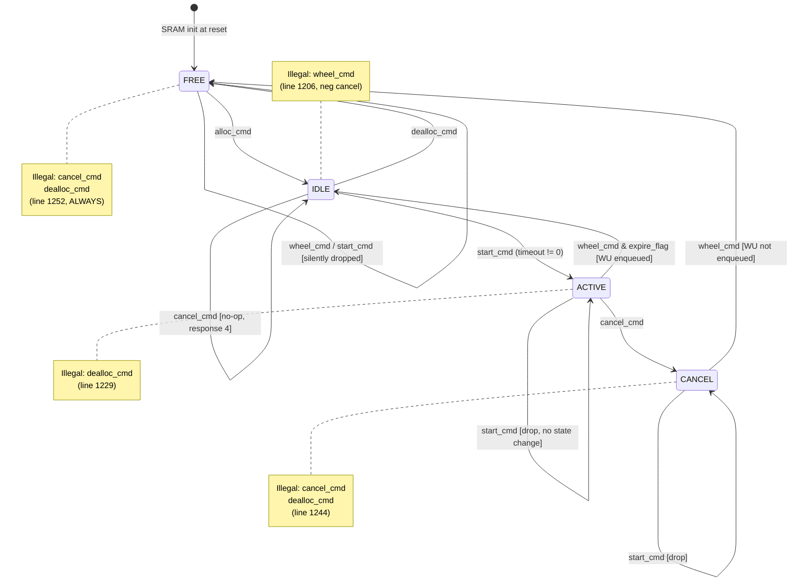
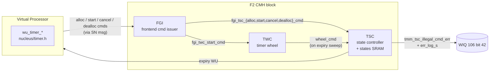
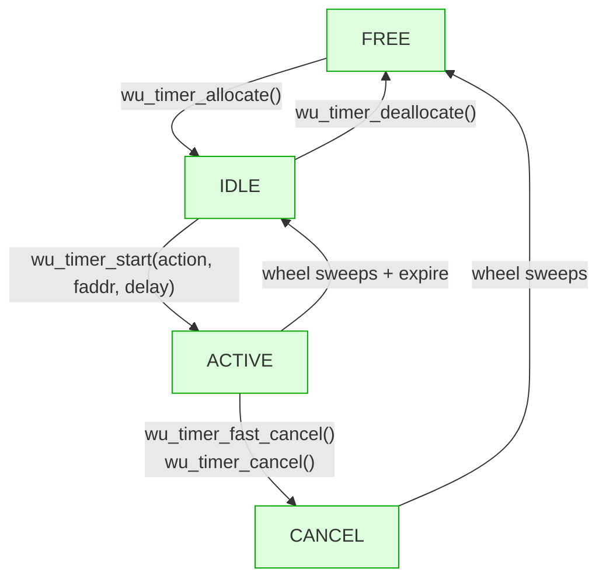
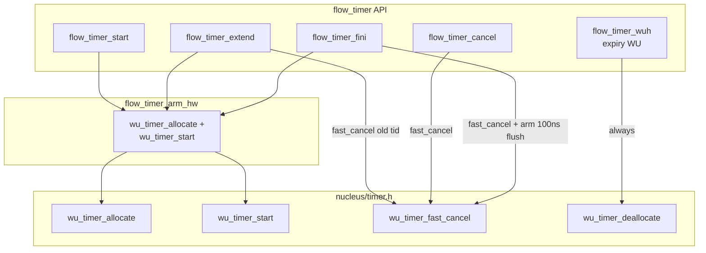

# F2 TMM Timer — RTL ↔ HW API ↔ SW API ↔ flow_timer

A walk down the stack: from the F2 RTL state machine in `pc_cmh_tmm_tsc.fv`, through the FGI command interface, the FunOS `nucleus/timer.h` / `hw_timer.h` accelerator API, the FunTCP `flow_timer` wrapper, and the race windows that follow from this layering.

References
- RTL: `asics/fip/pc/pc_cmh/rtl/pc_cmh_tmm_tsc.fv` (TMM Timer State Controller)
- FGI: `asics/fip/pc/pc_cmh/rtl/pc_cmh_tmm_fgi.fv` (Front-end Generator Interface)
- TWC: `asics/fip/pc/pc_cmh/rtl/pc_cmh_tmm_twc.fv` (Timer Wheel Controller)
- HW API: `FunSDK/.../FunOS/nucleus/timer.h`, `FunSDK/.../FunOS/legacy/hw/timer/hw_timer.h`
- HW API impl: `FunOS/hw/timer/hw_timer.c`
- flow_timer API: `FunSDK/.../FunOS/legacy/flows/flow_timer.h`
- flow_timer impl: `FunOS/flows/flow_timer.c`
- CSR layout: `FunSDK/.../FunChip/csr2/csr_types_pc_cmh_csr.h`

---

## 1. HW state machine (RTL-derived)

### 1.1 States

The TMM keeps a 2-bit state per timer ID, stored in the `timer_states` SRAM. SRAM is initialized to all-FREE on chip reset (`pc_cmh_tmm_tsc.fv:1426`).

| Encoding | Name | Meaning |
|----------|------|---------|
| 0 | `TIMER_IDLE`   | Allocated, not armed |
| 1 | `TIMER_ACTIVE` | Armed, sitting in the wheel |
| 2 | `TIMER_CANCEL` | Cancel pending; still in the wheel waiting for sweep |
| 3 | `TIMER_FREE`   | Unallocated (default) |

The C-side enum mirror is in `legacy/hw/timer/hw_timer.h`:
```c
#define timer_state_t(__e) \
    __e(CMH_TM_IDLE, 0, "idle") \
    __e(CMH_TM_ACTV, 1, "active") \
    __e(CMH_TM_CNCL, 2, "cancelled") \
    __e(CMH_TM_FREE, 3, "freed")
```

### 1.2 Commands reaching the TSC

Five command pulses (`pc_cmh_tmm_tsc.fv:151-154` and FGI outputs):

| Cmd | Source | Meaning |
|-----|--------|---------|
| `alloc_cmd`   | FGI (from VP `wu_timer_allocate()`)        | Pull a free entry, write IDLE |
| `start_cmd`   | FGI (from VP `wu_timer_start()`)           | Arm an IDLE timer with a timeout, push into TWC wheel |
| `cancel_cmd`  | FGI (from VP `wu_timer_fast_cancel()` / `wu_timer_cancel()`) | Mark for cancel before wheel sweeps |
| `dealloc_cmd` | FGI (from VP `wu_timer_deallocate()`)      | Release an IDLE entry back to FREE |
| `wheel_cmd`   | TWC (timer wheel sweep when the entry expires) | Fires expiry WU, transitions state |

`alloc_cmd` is special — it goes through a dedicated allocator path (free-list L1/L2) and writes IDLE atomically. The other four go through the **non-alloc state machine** below.

### 1.3 State transitions (decoded from `pc_cmh_tmm_tsc.fv:1181-1255`)



### 1.4 The "illegal" matrix

`tmm_tsc_illegal_cmd_err` asserts (`pc_cmh_tmm_tsc.fv:1269`) when a non-alloc cmd writes a state in this matrix:

| State \ Cmd | start | cancel | dealloc | wheel |
|---|---|---|---|---|
| IDLE   | ✅ → ACTIVE                  | ✅ no-op | ✅ → FREE   | ❌ illegal |
| ACTIVE | ✅ drop (already active)     | ✅ → CANCEL | ❌ illegal  | ✅ → IDLE / drop |
| CANCEL | ✅ drop                       | ❌ illegal | ❌ illegal  | ✅ → FREE |
| FREE   | ✅ drop (silent)              | ❌ illegal | ❌ illegal  | ✅ drop (silent) |

`enforce_p_err` is a poison-bit override (used by the enforce-poisoned-arg path); ignore for the common case. The dangerous quadrants are the four red ❌ cells:
- **ACTIVE+dealloc** — SW deallocated an armed timer (wrong API order)
- **CANCEL+cancel** — double cancel before wheel swept it
- **CANCEL+dealloc** — dealloc after cancel (instead of waiting for wheel)
- **FREE+cancel / FREE+dealloc** — cmd on a long-released entry

### 1.5 The error log register

When `tmm_tsc_illegal_cmd_err` fires, the register `pc_cmh_tmm_tsc_illegal_cmd_err_log` snapshots the offending event (`pc_cmh_tmm_tsc.fv:1272-1283`):

```c
struct csr_pc_cmh_tmm_tsc_illegal_cmd_err_log_S {
    uint32_t timer_id;     // [0+:18]
    uint8_t  core;         // [18+:3]   core that issued the cmd
    uint8_t  vp;           // [21+:2]   VP within that core
    uint8_t  state;        // [23+:2]   state at time of error
    bool     wheel_cmd;    // [25+:1]
    bool     start_cmd;    // [26+:1]
    bool     dealloc_cmd;  // [27+:1]
    bool     cancel_cmd;   // [28+:1]
};
```

The cmd bits in this register tend to "stick" across multiple offending events — repeated illegal cmds OR their flags into the captured value. Only the first event matters; rely on the `state` field for that.

---

## 2. The cmd interface (FGI / TWC) — what the HW expects



A few useful invariants from the RTL:
- `alloc_cmd` is a free-list pop that's tracked separately from the 4 non-alloc cmds. SW cannot trigger `tmm_tsc_illegal_cmd_err` via `alloc` — only via start/cancel/dealloc.
- `wheel_cmd` is HW-internal (TWC sweeps the wheel and pushes into TSC). SW never issues `wheel_cmd` directly.
- The wheel sweep enqueues the **expiry WU** (`tcs_fgi_data_s.tm_st_rsp.cmd = NM_TM_EXPIRE_RSP`, `pc_cmh_tmm_tsc.fv:1739-1741`) only when the state is ACTIVE+wheel+expire (i.e., natural expiry). On CANCEL+wheel the entry just goes to FREE without dispatching a WU.
- `tm_id_free_cnt` increments on every transition that lands in FREE (lines 1189, 1240) and decrements on alloc (1322). This is the counter exposed to SW as `timer_get_free_count()`.

---

## 3. SW accelerator API — `nucleus/timer.h` + `legacy/hw/timer/hw_timer.h`

The HW API the rest of FunOS sees. Two header pairs:

| Header | Purpose |
|---|---|
| `nucleus/timer.h`            | Per-timer SW API (alloc / start / cancel / dealloc) |
| `legacy/hw/timer/hw_timer.h` | Cluster-level diagnostics, error decode, free-count, props bridge |

### 3.1 Per-timer API (declared in `nucleus/timer.h`)

```c
timerid_t wu_timer_allocate(void);             // FREE → IDLE; busy-waits if free-list empty
timerid_t wu_timer_allocate_or_none(void);     // returns TIMER_INVALID if pool empty

#define wu_timer_start(tid, action, faddr, arg, delay) \
    _wu_timer_start(tid, WUID(action), faddr, arg, delay)
// IDLE → ACTIVE; arms timer to fire `action` on `faddr` after `delay` ns.
// Delay must be in [MIN_HW_DELAY=1024 ns, MAX_HW_DELAY≈65 ms].

enum fun_ret wu_timer_cancel(timerid_t);       // ACTIVE → CANCEL; waits for HW response
void         wu_timer_fast_cancel(timerid_t);  // ACTIVE → CANCEL; fire-and-forget
enum fun_ret wu_timer_deallocate(timerid_t);   // IDLE → FREE; must NOT be called on ACTIVE
```

`wu_timer_fast_cancel` is unique: no response, no return value. The doc warns:
> "Knowing when you can safely use `wu_timer_fast_cancel` requires a fair amount of thought - generally you need to guarantee that the timer would be deallocated if the timer fires in spite of your attempt to cancel it."

This is the API that lets SW issue cancel without serialization — and is the surface area of every race in §6.

### 3.2 Mapping API → HW transitions



The two "natural" cycles:
- **Cancel-before-fire**: alloc → start → cancel → wheel → free.
- **Fire-then-dealloc**: alloc → start → wheel(expire, WU dispatched) → IDLE → dealloc → free.

Note: there is **no** "ACTIVE → FREE" transition in HW. After a timer fires, SW *must* call `wu_timer_deallocate` to release the entry. After a successful cancel, SW *must not* call dealloc — the wheel sweep itself frees the entry.

### 3.3 Cluster-level API (declared in `legacy/hw/timer/hw_timer.h`)

```c
struct timer_error {
    timerid_t   error_timer;    // timer_id from err_log
    faddr_t     error_vp;       // FADDR(cluster, LID_VP(core,vp), 0)
    timer_state_t state;        // CMH_TM_{IDLE,ACTV,CNCL,FREE}
    bool wheel_error, start_error, dealloc_error, cancel_error;
};

bool   timer_read_error(cluster_t, struct timer_error *);   // reads + decodes err_log_s
void   timer_print_error(struct timer_error *);             // pretty-prints LOG_ERR
bool   timer_show_error(cluster_t);                         // read + print combo
void   timer_clear_interrupt(cluster_t);                    // ack the WIQ fatal

uint64_t timer_get_free_count(void);          // cur free entries on local cluster
uint64_t timer_get_min_free_count(void);      // watermark of min free seen
bool     timer_usage_per_cluster_get(cluster_t, uint64_t stats[TIMER_COUNT_MAX]);
```

`timer_show_error()` is the function that should be wired into the WIQ-106 bit-42 fatal path so that recurrences self-decode. As of today the WIQ handler dumps raw register hex only (see ADO 3513518 triage notes).

---

## 4. flow_timer — a wrapper around `nucleus/timer.h`

`flow_timer` (`flows/flow_timer.{c,h}`) layers two features on top of the raw HW API:
1. **Arbitrary-duration support.** HW timers max out at ~65 ms; long durations are chunked.
2. **Per-flow lifecycle integration.** Cancellation, teardown flush, and pending-flag tracking are tied to a flow.

It is the timer abstraction used by FunTCP (`tcp_internal.h:145 struct flow_timer tcp_flow_timer`), RDMA admin, IPMI sessions, time_sync, and TM subscription. (Apps `tcp_pkt_gen` / `tcp_pkt_rcv` bypass it and call the raw `wu_timer_*` API directly.)

### 4.1 Per-flow data

```c
struct flow_timer {
    struct timer_arg flow_timer_arg;        // first field; container_of unwinds from arg
    timerid_t        flow_timer_tid_allocated;   // SW-side tracker; TIMER_INVALID if no timer
    flow_timer_callback_t flow_timer_callback;   // user's expiry callback
};

struct flow_with_timer {
    struct flow      flow;
    struct flow_timer timer;
};
```

The contract documented in the header:
- "All flow_timer_*() APIs must be called from the flow's home VP."
- "It is safe to skip initialization entirely if the flow never uses a timer."
- The expiry WU runs on `flow_dest(f)` (the home VP).

### 4.2 Public API

```c
void  flow_timer_init(struct flow *, struct flow_timer *, flow_timer_callback_t);
void  flow_with_timer_init(struct flow_with_timer *, flow_timer_callback_t);
void  flow_timer_start(struct flow *, fun_time_t duration);  // assert: not pending
void  flow_timer_extend(struct flow *, fun_time_t duration); // assert: pending
bool  flow_timer_cancel(struct flow *);                      // ok if not pending
// Private (driven by flow flush logic):
bool  flow_timer_fini(struct flow *);
```

### 4.3 Internal mapping to `nucleus/timer.h`



### 4.4 Long-duration chunking

In `flow_timer_start` (`flow_timer.c:159`):
- If `duration <= MAX_HW_DELAY` → `flow_timer_arg.value = 0` (sentinel, fast path).
- If `duration  > MAX_HW_DELAY` → record absolute `deadline = fun_time_now() + duration` in `flow_timer_arg.value` and arm for `MAX_HW_DELAY`.

In `flow_timer_wuh` (`flow_timer.c:320`):
1. **Always** call `wu_timer_deallocate(tid_fired)`.
2. If `tid_fired != ft->flow_timer_tid_allocated`, return (stale fire, was cancelled).
3. Read deadline; if not yet reached, allocate a new tid and `flow_timer_arm_hw()` for the remaining duration.
4. Otherwise invoke the user callback.

### 4.5 Flow teardown

`flow_timer_fini` (`flow_timer.c:251`) is *not* part of the public API; it is invoked by `flow_flush_for_fini_*` during flow destruction. It cancels the user's timer and arms a tiny 100 ns flush timer with `flow_timer_fini_done_cb` so that any in-flight expiry WU drains before the flow is freed. The author's comment at line 263 acknowledges: "cancels are never guaranteed to succeed".

---

## 5. tcp_pkt_gen / tcp_pkt_rcv — raw `wu_timer_*` direct usage

The apps do **not** use `flow_timer`. They call the low-level API and implement their own pending-flag pattern (`bw_timer.bwTimer`, `tc_f.leakyBktTimer`, `ts_f.leakyBktTimer`).

### 5.1 Allocation, start, cancel

```c
// allocation path (tcp_pkt_gen.c:1323, 3596; tcp_pkt_rcv.c:3043)
t->bwTimer = wu_timer_allocate();
wu_timer_start(t->bwTimer, calcIntvBw, vp, &t->bwTimerArg, FUN_TIME_FROM_USECS(measIntv));

// cancel path (tcp_pkt_gen.c:1558, 3110; tcp_pkt_rcv.c:803)
wu_timer_fast_cancel(t->bwTimer);
t->bwTimer = TIMER_INVALID;
```

### 5.2 The expiry WU (5 paths, 3 of which leak)

```c
WU_HANDLER(calcIntvBw, ...) {
    tid_fired = tid_shifted >> 32;
    t = (struct bw_timer *)timer_arg->value;

    if (t == NULL) { return; }                              // P1 — silent return, no dealloc
    if (tid_fired != t->bwTimer) {
        wu_timer_deallocate(tid_fired); return;             // P2 — dealloc stale tid
    }
    if (t->bwTimer == TIMER_INVALID) { return; }            // P3 — DEAD CODE (P2 fires first)
    /* ... work ... */
    if (t->state == P2_TIMER_START && t->bwTimer != TIMER_INVALID) {
        wu_timer_start(t->bwTimer, ...);                    // P4 — re-arm same tid
    }
    // P5 (re-arm condition false): silent return — no dealloc
}
```

Per the RTL the tid is **IDLE** when the WU runs (wheel fire moved it ACTIVE→IDLE before dispatching the WU). Three of the five paths (P1, P3, P5) take no action. The wheel will not sweep an IDLE entry; only `dealloc_cmd` can move IDLE→FREE. So every WU that exits via P1, P3, or P5 leaks one tid permanently.

P3 is also dead code — if `tid_fired != t->bwTimer` and `t->bwTimer == TIMER_INVALID`, P2 fires first.

### 5.3 Why this differs from `flow_timer`

| Concern | flow_timer | tcp_pkt_gen / tcp_pkt_rcv |
|---|---|---|
| Dealloc on every fire | ✅ unconditional (`flow_timer.c:334`) | ❌ only on stale path (P2) |
| Fresh tid per arm | ✅ always `wu_timer_allocate()` inside `flow_timer_arm_hw` | ❌ reuses same tid via in-place `wu_timer_start` |
| Teardown drain | ✅ `flow_timer_fini` → 100 ns flush before flow free | ❌ none — `tcp_pkt_socket_teardown` cancels then immediately frees `tc_f` |
| Reachable WU paths | All paths sound | 3 of 5 leak |
| NULL/UAF guard | tid_fired alone can advance the SW state | Multiple derefs of `t`/`tc_f` before NULL check (`upd_tx_leaky_bkt:3237`) |

`flow_timer` is the correct model for this stack. The apps are the divergence.

### 5.4 Concrete bugs in tcp_pkt_gen / tcp_pkt_rcv

#### B1 — Three leak paths in the expiry WU
P1, P3, P5 each leave the tid stuck in IDLE forever. Under sustained load (100 conns × bwTimer × leakyBktTimer × many expiries/sec), the cluster's `tm_id_free_cnt` slowly drains. Eventually `wu_timer_allocate()` busy-waits and TCP setup stalls.

#### B2 — `stopBwTimer` is a no-op against IDLE entries
```c
void stopBwTimer(struct bw_timer *t) {
    if (t->state == P2_TIMER_START) {
        ...
        wu_timer_fast_cancel(t->bwTimer);
        t->bwTimer = TIMER_INVALID;
    }
}
```
If the wheel already fired before this `cancel_cmd` reaches HW, the tid is **IDLE**, and per RTL line 1206 `cancel_cmd` on IDLE is a legal no-op (`response 4`). State stays IDLE. After this, `t->bwTimer = INVALID` so no future WU will dealloc it (no future WU exists — the timer is no longer running). The tid is **permanently leaked**.

`flow_timer` does not have this problem because its expiry WU always deallocs on every fire, so the tid is back to FREE before SW issues any cancel.

#### B3 — No teardown flush ⇒ UAF on `tc_f` / `bw_timer`
`tcp_pkt_socket_teardown` runs cancel and immediately frees `tc_f`, with no equivalent of `flow_timer_fini`'s 100 ns drain. If the wheel fired before the cancel reached HW, the expiry WU is in flight referencing `&t->bwTimerArg` — now freed memory. When the WU runs:

```c
t = (struct bw_timer *)timer_arg->value;   // reads freed memory → garbage `t`
if (t == NULL) { ... }                     // garbage rarely matches NULL
if (tid_fired != t->bwTimer) { ... }       // garbage compare
```

Two outcomes:
- garbage `t->bwTimer == tid_fired` by chance → P4 → `wu_timer_start(tid_fired, …, &t->bwTimerArg, …)` re-arms a timer whose `timer_arg` points at freed memory. The next fire repeats the UAF chain.
- garbage `t->bwTimer != tid_fired` → P2 → `wu_timer_deallocate(tid_fired)`. Often legal in isolation, but the "stale" detection has fired without any real cancel having occurred. Once another connection has acquired the same tid via the free list, you have aliasing between a stale WU and a live timer.

#### B4 — NULL-check ordering in `upd_tx_leaky_bkt`
```c
SYSLOG_D(NULL, DEBUG, "...tc_f->leakyBktTimer=%u, socketid=%" PRIu64,
         ..., tc_f->leakyBktTimer, tc_f->socketid);     // deref
if (tid_fired != tc_f->leakyBktTimer) { ... }            // deref
if (tc_f == NULL) { return; }                            // NULL check ← too late
```
Same bug in `upd_rx_leaky_bkt`. Independent of the timer state machine, this NULL-derefs before the guard.

#### B5 — Tid reuse via in-place `wu_timer_start`
P4's `wu_timer_start(t->bwTimer, ...)` is technically legal (IDLE+start → ACTIVE) but concentrates the timer's lifetime on a single tid value over many fires. `flow_timer` allocates a fresh tid every time, so a stale WU can never alias a live timer. With tcp_app's pattern, **a stale WU and a live timer can carry the same tid**, and once UAF + tid-aliasing combine, the HW transition any of the five WU paths take stops being predictable — including the path to FREE+dealloc.

### 5.5 Smallest fix to bring tcp_app to parity with flow_timer

In each of `calcIntvBw`, `upd_tx_leaky_bkt`, `upd_rx_leaky_bkt`, mirror `flow_timer_wuh` exactly:

```c
WU_HANDLER(calcIntvBw, ...) {
    tid_fired = tid_shifted >> 32;
    t = (struct bw_timer *)timer_arg->value;

    wu_timer_deallocate(tid_fired);             // ALWAYS dealloc (IDLE → FREE)
    if (t == NULL) return;
    if (tid_fired != t->bwTimer) return;        // stale: tid_fired already returned to FREE
    t->bwTimer = TIMER_INVALID;

    /* ... work ... */

    if (t->state == P2_TIMER_START) {
        t->bwTimer = wu_timer_allocate();       // fresh tid
        wu_timer_start(t->bwTimer, ...);
    }
}
```

Plus:
- Move the NULL check ahead of every deref in `upd_tx_leaky_bkt` / `upd_rx_leaky_bkt`.
- Add a teardown flush analogous to `flow_timer_fini` before `tc_f` / `bw_timer` are freed — or migrate these app-level timers onto `flow_timer` directly.

---

## 6. Race windows in this stack

### 6.1 The fundamental hazard

`wu_timer_fast_cancel` and `wu_timer_deallocate` issue `cancel_cmd` / `dealloc_cmd` to the TSC. SW only knows the **last cmd it issued**, not the current HW state. Between SW's pending-flag check and the cmd reaching the TSC SRAM, the wheel sweep can move the entry to a different state. Any cancel/dealloc that lands on `FREE` or `CANCEL` (for cancel) or `ACTIVE`/`CANCEL`/`FREE` (for dealloc) lights up `tmm_tsc_illegal_cmd_err`.

### 6.2 Race A — `flow_timer_extend` cancel-after-fire

```
T0: flow_timer_arm_hw(f, X)        [SW]   → state ACTIVE
T1: wheel sweeps                    [HW]   → state IDLE; expiry WU enqueued
T2: SW issues fast_cancel(X) before flow_timer_wuh runs
       → state IDLE+cancel         [legal, no-op]
T3: flow_timer_wuh runs
       → wu_timer_deallocate(X)    → state IDLE+dealloc → FREE   [legal]

   Or the reverse order:

T1': SW issues fast_cancel(X) before wheel sweeps
       → state ACTIVE+cancel       → CANCEL                       [legal]
T2': wheel sweeps the CANCEL entry
       → state CANCEL+wheel        → FREE                         [legal, no WU dispatched]

   The bad case:

T0:  flow_timer_arm_hw(f, X)
T1:  wheel sweeps                              → state IDLE; WU enqueued for VP_dest
T2:  flow_timer_wuh begins on VP_dest
T3:  wu_timer_deallocate(X) issued             → state IDLE+dealloc → FREE
T4:  ft->flow_timer_tid_allocated = TIMER_INVALID    [SW flag still old between T3 and T4]
T3.5 (between T3 and T4): different VP X path runs flow_timer_extend(f, ...)
       sees pending=true (flag still X)
       issues fast_cancel(X)                   → state FREE+cancel → ⚡ ILLEGAL ⚡
```

The doc says callers must run on the home VP; if VP A (running `flow_timer_wuh`) and VP B (running `flow_timer_extend`) are the same VP, this race is closed by serial execution. It opens whenever the contract is broken — e.g., XMT-side `tcp_fsm_rxmt_timer_update` (`tcp_xmt.c:1740`) calling FSM-side `flow_timer_extend` cross-VP.

### 6.3 Race B — tcp_app divergence from flow_timer (not a symmetric "both are wrong")

The flow_timer convention is correct against the RTL. The bugs are in `tcp_pkt_gen` / `tcp_pkt_rcv` only. See §5.4 for the five concrete issues (B1–B5). At the state-machine level, the dangerous cascade is:

```
1. Connection A starts:  alloc → start → ACTIVE (tid X)
2. Wheel fires X:        ACTIVE → IDLE; expiry WU enqueued (still pending dispatch)
3. stopBwTimer(A):       cancel(X) → IDLE+cancel = no-op (legal but no state change)
                         t->bwTimer = INVALID
4. tcp_pkt_socket_teardown: tc_f freed (NO flush wait)
5. Wheel-fire WU runs against freed memory:
     case (a) garbage(t->bwTimer) ≠ tid_fired
              → P2: wu_timer_deallocate(X); IDLE → FREE  [legal but spurious dealloc]
              → tid X now on free list while another VP may already have allocated it
     case (b) garbage(t->bwTimer) == tid_fired (chance match)
              → P4: wu_timer_start(X, …, &freed_arg, …) → IDLE → ACTIVE
              → next fire reads more freed memory; iterate
     case (c) tid_fired path falls into P1/P3/P5
              → no dealloc, X stuck in IDLE forever (leak)
```

Cases (a)+(b) combined with normal connection churn produce the conditions for FREE+(cancel|dealloc) — once a stale dealloc returns the tid to the free list while a sibling connection's path still holds the SW pointer, the next cancel/dealloc on that pointer lands on a state the issuer did not anticipate.

### 6.4 Race C — `flow_timer_fini` cancel during teardown

`flow_timer_fini` is the same as Race A but synchronously followed by allocation of a 100 ns flush timer. The original tid X may already be FREE when the cancel hits. Note the in-source comment "cancels are never guaranteed to succeed" — the author was aware.

### 6.5 Race D — early-fire reload self-race

`tcp_fsm_timer_hw_expired` (`tcp_fsm.c:1170`) detects a fire that's "earlier than the recorded expected expiry" and calls `tcp_fsm_timer_reload` (which calls `flow_timer_start`). `flow_timer_start` allocates a new tid and arms it without touching the old one; the old tid was already deallocated by `flow_timer_wuh:334`. This is fine in isolation, but if cross-VP `flow_timer_extend` was inflight on the old tid, it falls into Race A.

### 6.6 Race E — cross-VP cancel without serialization

`flow_timer_tid_allocated` lives in a flow CB that may be touched from multiple VPs (see `tcp_fsm_rxmt_timer_update` from `tcp_xmt.c:1740`). The header explicitly disallows this ("flow's home VP only") but there is no assert — only the existing `FLOW_TIMER_ASSERT` in `flow_timer.c:42-48` which is `CONFIG_DEBUG`-gated and only checks the running VP, not the issuing VP for cancel. Adding a runtime assert in `wu_timer_fast_cancel` against the timer's owner VP would catch any caller violating the contract.

### 6.7 What the ADO 3513518 register decode tells us

`tmm_tsc_illegal_cmd_err_log = 0x1ffff830` decodes (per §1.5):
- timer_id = 0x3f830, core=7, vp=3
- **state = FREE**
- cmd flags 1111 (sticky — multiple events accumulated)

Per §6.1, only the dangerous quadrant **`FREE + (cancel | dealloc)`** matches. The register cannot tell us whether the issuer was Race A, B, C, D or E — but every one of them ultimately writes a cancel or dealloc onto a FREE entry. Decoding `core=7, vp=3` against per-VP last-WU state is the next step (HBM crashdump walk).

---

## 7. Recommendations for fixing this class of bug

1. **Bring the apps in line with `flow_timer`.** With the RTL in hand, the convention is unambiguous: every expiry WU must `wu_timer_deallocate(tid_fired)` exactly once, and every re-arm must come from a fresh `wu_timer_allocate()`. `flow_timer_wuh` already does this; `calcIntvBw` / `upd_tx_leaky_bkt` / `upd_rx_leaky_bkt` do not. See §5.5 for the smallest fix.

2. **HW-state-aware idempotent wrappers.** `wu_timer_fast_cancel` and `wu_timer_deallocate` could read the `timer_states` SRAM (or a shadow) and skip when the entry is already in the requested target state. This costs cycles but closes every race window in this document.

3. **Wire `timer_show_error()` into the WIQ 106 fatal handler.** Already present in `hw_timer.c:48-58`, but never invoked from the WIQ path. A 1-line change.

4. **Per-tid last-cmd ringbuffer.** Compile-time gated. On WIQ fatal, dump the ring; pinpoints the offending wrapper without HBM walks.

5. **Owner-VP assert in `wu_timer_fast_cancel`.** Catch contract violations (§6.6) cheaply.

---

## 8. Quick reference — dropping into a fatal investigation

When you see WIQ 106 bit 42 (`tmm_tsc_illegal_cmd_err`):
1. Read `tmm_tsc_illegal_cmd_err_log` and decode with `csr_unpack_pc_cmh_tmm_tsc_illegal_cmd_err_log()` (or call `timer_show_error()` if instrumentation is in place).
2. Look at the `state` field. That field — combined with the cmd flags — uniquely identifies which quadrant of the illegal matrix in §1.4 was hit.
3. Use `core` + `vp` from the log to identify the issuer VP, then walk the WU stack on that VP at crash time to find the call site.
4. Cross-reference `timer_id` against any flow CBs whose `flow_timer_tid_allocated` (or app-specific timer field) matches.
5. Reading list: this doc, `pc_cmh_tmm_tsc.fv:1181-1255`, `flows/flow_timer.c:294-340`, the relevant app's expiry handler.
