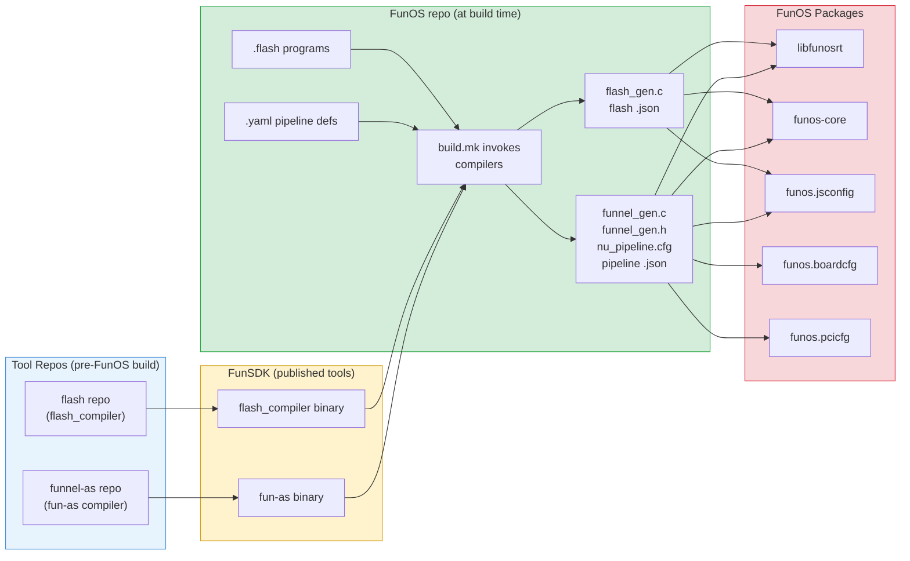
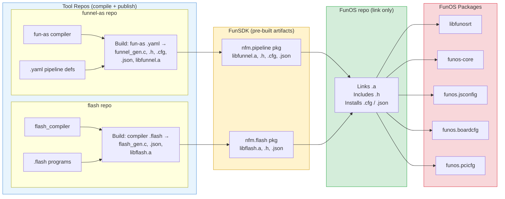
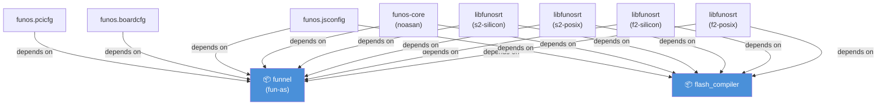
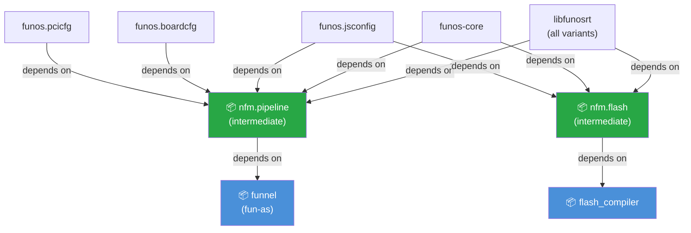

# Flash & Funnel Build Options — Where Should Source Programs Live?

**Context:** Meeting follow-up from "Flash program relocation and build process updates" (Apr 16, 2026)
**Attendees:** Neha Tapkir, Balakrishna Duttuluru, Suresh Nedunchezhian, Parag Pangare, Rama Krishna B S
**Participants in prior chat:** Srinivas Akkipeddi, Artur Novotarskyi

---

## Problem Statement

Flash (`.flash` programs) and Funnel (`.yaml` pipeline definitions) share the same build challenge: their source files produce **generated artifacts** (C code, JSON configs, static libraries) that must be available in FunSDK **before** FunOS packages compile. Today there are no build-order dependencies in `projectdb.json`, causing `fun-as: No such file` and `flash_compiler: No such file` failures in Jenkins/ADO/DNA builds when `ENABLE_NFM=1`.

This applies equally to **funnel** (pipeline YAML → C, JSON, cfg) and **flash** (`.flash` → JSON, C).

---

## Build Flow Diagrams

### Option 1: Source Programs Stay in FunOS



### Option 2: Source Programs in Tool Repos (funhci model)



---

## Dependency Graphs (projectdb.json)

### Option 1: Direct Dependencies (many edges)



### Option 2: Intermediate Package (few edges)



---

## Option 1: Source Programs Stay in FunOS

Source `.yaml` and `.flash` files remain in FunOS. FunOS build.mk invokes the compiler tools (fun-as, flash_compiler) during the FunOS build to produce generated code in-tree.

### Artifacts & Flow

```
funnel-as repo                flash repo
  └── fun-as (compiler)         └── flash_compiler (Rust binary)
        │                              │
        ▼                              ▼
   Published to FunSDK           Published to FunSDK
   (bob package: funnel)         (bob package: flash_compiler)
        │                              │
        ▼                              ▼
┌─────────── FunOS repo ───────────────────────┐
│  .yaml files (networking/core/nfm/funnel/)   │
│  .flash files (networking/core/nfm/flash/)   │
│                                              │
│  build.mk invokes fun-as → funnel_gen.c,     │
│    funnel_gen.h, nu_pipeline.cfg, *.json     │
│  build.mk invokes flash_compiler → *.json,   │
│    flash_gen.c                               │
└──────────────────────────────────────────────┘
```

### Artifacts Produced (at FunOS build time)

| Tool | Input | Output | Consumed by |
|------|-------|--------|-------------|
| `fun-as` | `.yaml` pipeline defs | `funnel_gen.c`, `funnel_gen.h`, `nu_pipeline.cfg`, pipeline `.json` | libfunosrt, funos-core, funos.jsconfig, funos.boardcfg, funos.pcicfg |
| `flash_compiler` | `.flash` programs | Flash `.json` configs, `flash_gen.c` | libfunosrt, funos-core, funos.jsconfig |

### Dependencies Required (projectdb.json)

Every FunOS package that compiles source or installs configs needs explicit deps on `funnel` and `flash_compiler`:

| FunOS Package | Must Depend On |
|---------------|---------------|
| `libfunosrt` (4 variant groups × chips) | `funnel`, `flash_compiler` |
| `funos-core` (noasan) | `funnel`, `flash_compiler` |
| `funos.jsconfig` | `funnel`, `flash_compiler` |
| `funos.boardcfg` | `funnel` |
| `funos.pcicfg` | `funnel` |

**Total: ~8-10 dependency additions per tool in projectdb.json**

### Prototype Branches

| Repo | Branch |
|------|--------|
| FunOS | [`akki/realnfm`](https://github.com/fungible-inc/FunOS/tree/akki/realnfm) |
| FunSDK | [`suresh/nfm-funnel-dep`](https://github.com/fungible-inc/FunSDK-small/tree/suresh/nfm-funnel-dep) |

### Pros

- Source files live next to the only consumer (FunOS) — easier to iterate on pipeline definitions
- No new packages to maintain
- Simpler conceptual model: "FunOS has everything it needs"

### Cons

- **Heavy projectdb.json churn** — every FunOS package needing generated output must list compiler tools as deps
- **Redundant invocations** — fun-as/flash_compiler runs once per package (not shared)
- **Not future-proof** — new FunOS packages must remember to add `funnel`/`flash_compiler` deps
- Build infrastructure team pushback on dep count

---

## Option 2: Move Source Programs to Compiler Repos (funhci model)

Move `.yaml` files to `funnel-as` repo and `.flash` files to the `flash` repo. Each repo compiles its programs and publishes **pre-built artifacts** (`.a`, `.c`, `.h`, `.cfg`, `.json`) into FunSDK. FunOS simply consumes the pre-built outputs.

### Artifacts & Flow

```
funnel-as repo                    flash repo
├── fun-as (compiler)             ├── flash_compiler (Rust binary)
├── *.yaml (pipeline defs)        ├── *.flash (program defs)
│                                 │
│ fun-as compiles .yaml →         │ flash_compiler compiles .flash →
│   funnel_gen.c, .h, .cfg,      │   flash_gen.c, *.json
│   *.json, libfunnel.a           │   libflash.a
│                                 │
└── Published to FunSDK           └── Published to FunSDK
    (bob package: funnel)             (bob package: flash_compiler)
        │                                  │
        ▼                                  ▼
┌─────────── FunOS repo ───────────────────────┐
│  No .yaml or .flash source files             │
│  Links pre-built .a, includes .h             │
│  Installs pre-built .cfg / .json             │
└──────────────────────────────────────────────┘
```

### Artifacts Produced (at funnel/flash build time, published to FunSDK)

| Package | Artifacts Published | Install Location in FunSDK |
|---------|--------------------|-----------------------------|
| `funnel` (new: `nfm.pipeline`) | `libfunnel.a`, `funnel_gen.h`, `nu_pipeline.cfg`, pipeline `.json` | `FunSDK/lib/`, `FunSDK/include/`, `FunSDK/cfg/` |
| `flash_compiler` (new: `nfm.flash`) | `libflash.a`, `flash_gen.h`, flash `.json` | `FunSDK/lib/`, `FunSDK/include/`, `FunSDK/cfg/` |

### Dependencies Required (projectdb.json)

A single intermediate package (e.g., `nfm.pipeline`, `nfm.flash`) replaces many per-package deps:

| Change | Detail |
|--------|--------|
| New package `nfm.pipeline` | Depends on `funnel`, produces pre-built artifacts |
| New package `nfm.flash` | Depends on `flash_compiler`, produces pre-built artifacts |
| FunOS packages | Depend on `nfm.pipeline` / `nfm.flash` (replaces `nu.pipeline`) |

**Total: 1-2 new packages + fewer per-package deps**

### Prototype Branches

| Repo | Branch |
|------|--------|
| FunOS | [`akki/funnelnfm`](https://github.com/fungible-inc/FunOS/tree/akki/funnelnfm) |
| FunSDK | [`akki/funnelpipeline`](https://github.com/fungible-inc/FunSDK-small/tree/akki/funnelpipeline) |
| funnel-as | [`akki/funnelpipeline`](https://github.com/fungible-inc/funnel-as/tree/akki/funnelpipeline) |

### Existing Precedent: libfunhci

| Layer | funhci model | Proposed funnel/flash model |
|-------|-------------|----------------------------|
| **Tool repo** | FunHCI repo (has `.hci` + `generator.py`) | funnel-as (has `.yaml` + `fun-as`), flash (has `.flash` + compiler) |
| **Generator package** | `libfunhci.headers` / `libfunhci~${machine}` (runs tool → `.h`, `.a`) | `nfm.pipeline` (runs fun-as → `.c`, `.h`, `.cfg`, `.json`, `.a`) |
| **Consumer** | FunOS links `.a`, includes `.h` | FunOS links `.a`, includes `.h`, installs `.cfg`/`.json` |

### Pros

- **Clean build model** — matches existing funhci pattern the build team already supports
- **Fewer projectdb.json deps** — FunOS packages depend on intermediate package, not raw tools
- **Single invocation** — compiler runs once, output shared by all FunOS consumers
- **Future-proof** — new FunOS packages automatically get artifacts via `nfm.pipeline`/`nfm.flash`
- Replaces `nu.pipeline` directly

### Cons

- **Split ownership** — pipeline/flash source files move away from FunOS (only consumer)
- **Extra complexity** — new packages to create and maintain
- **Iteration friction** — changing a `.yaml` or `.flash` requires building funnel-as/flash repo first, then FunOS
- **Not yet compiling** — Srinivas noted the prototype "still does not compile but it is a start"
- `nu.pipeline` cannot be fully removed yet — some chips still need it (per Srinivas, Apr 16)

---

## Key Discussion Points from Chat (Apr 7–16)

| Date | Who | Key Point |
|------|-----|-----------|
| Apr 7 | Suresh | Flash has the same problem as funnel; proposed funhci model option |
| Apr 8 | Artur | dpuNetworking also uses fun-as → concern about moving .yaml out of FunOS |
| Apr 8 | Suresh | With NFM, dpuNetworking will no longer have .yaml files. Prefers keeping .yaml in FunOS but acknowledges config json timing issue |
| Apr 14 | Srinivas | Prototyped Option 2 — moved code to funnel-as, generates .a and .cfg. Not compiling yet. Dep count similar either way |
| Apr 16 | Artur | Reviewed branches. FunSDK changes valid. Asked if nu.pipeline can be disabled |
| Apr 16 | Srinivas | Cannot disable nu.pipeline — some chips still need it, not ready for all |

---

## Comparison Summary

| Criteria | Option 1: Source in FunOS | Option 2: Source in Tool Repos |
|----------|:---:|:---:|
| **Source file location** | FunOS | funnel-as / flash repo |
| **Who compiles programs** | FunOS build.mk | Tool repo build (pre-FunOS) |
| **projectdb.json dep count** | High (~8-10 per tool) | Low (1-2 intermediate pkgs) |
| **Build model pattern** | Ad-hoc | Matches funhci precedent |
| **Compiler invocations** | Once per FunOS package | Once total (shared) |
| **Developer iteration** | Fast (edit in FunOS, rebuild) | Slower (edit in tool repo, publish, then FunOS) |
| **nu.pipeline replacement** | No | Yes (direct replacement) |
| **Prototype status** | Works (with dep additions) | Not yet compiling |
| **Future-proof** | No (manual dep per new pkg) | Yes (auto via intermediate pkg) |

---

## Decision Needed

1. **Which option to pursue?** Option 1 is quickest to land but heavier on deps. Option 2 is cleaner long-term but needs more work.
2. **Phased approach?** Land Option 1 now to unblock NFM, then migrate to Option 2?
3. **Flash specifics:** Does flash follow the exact same model as funnel, or are there differences in artifact types (Balakrishna to confirm)?
4. **nu.pipeline coexistence:** How long do we need to keep nu.pipeline alongside the new approach?
