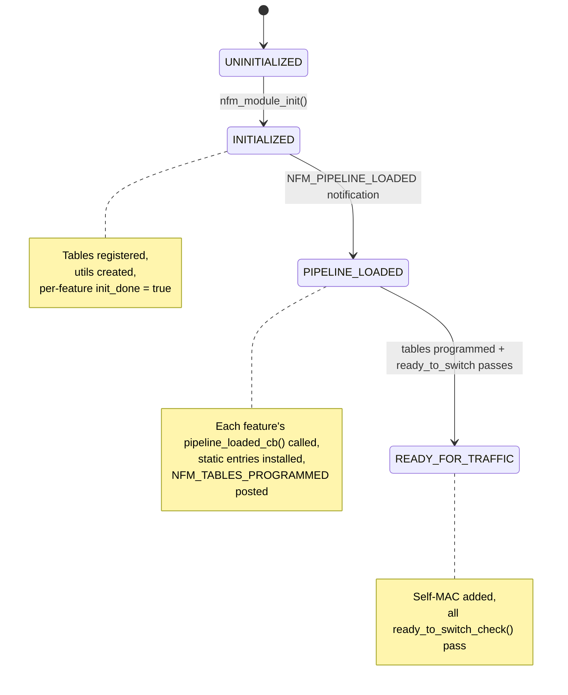
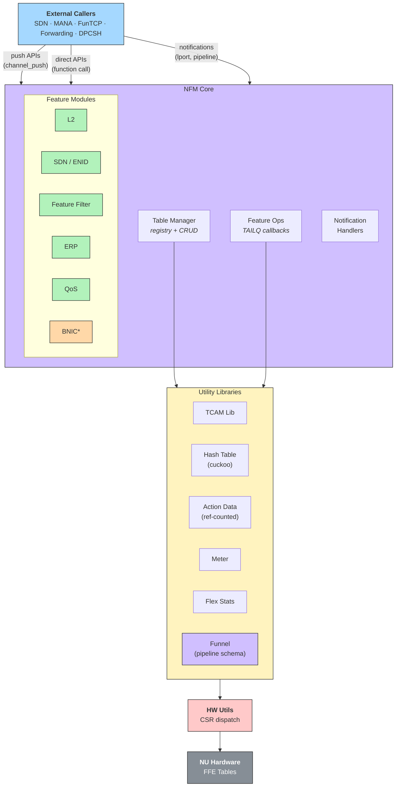

# NFM (NU Forwarding Module) — Architecture Document

## 1. Overview

NFM is the core software module in FunOS responsible for programming the NU (Network Unit) forwarding pipeline. It manages all FFE (Flexible Forwarding Engine) lookup tables — hash, TCAM, and DIT — across the Main, ERP, and Extension forwarding instances. NFM serves as the abstraction layer between higher-level networking features (SDN, BNIC/MANA, FunTCP, FunRDMA) and the underlying hardware forwarding tables.

**Supported Chips:** S2, F1D1 (S21F1), F2 (S21F2), S3

**Build Gate:** `ENABLE_NFM` — when disabled, only the Funnel and BNIC/NH stubs are compiled.

---

## 2. Directory Structure & Module Map

```
nfm/
├── nfm_init.c              # Module init, global nfm_t, sequencing
├── nfm_internal.h          # Global nfm_t struct, internal APIs
├── nfm_notification.c/h    # Pipeline-loaded / tables-programmed notifications
├── nfm_tblmgr.c/h          # Table manager — registration, add/delete/dump
├── nfm_dpcsh.c/h           # DPCSH verb handlers for debug/config
├── nfm_csrreplay.c         # Legacy CSR replay entries (to be obsoleted)
├── build.mk                # Build rules, ENABLE_NFM gating
│
├── bnic/                   # Public API stubs for BNIC and SDN push APIs
│   ├── nfm_api.c           # MHG RW / CLBP stubs
│   ├── nfm_bnic_api.c      # BNIC vPort/filter/RSS stubs
│   └── nfm_sdn_api.c       # ENID push API stubs
│
├── sdn/                    # SDN ENI ID (ENID) lookup management
│   ├── enid.c/h            # MAC→ENID hash table programming
│   └── enid_internal.h     # Internal table-manager struct
│
├── erp/                    # ERP (Egress Reprocessing Pipeline) FFE
│   ├── erp_ffe.c/h         # ERP init, static entries, flex stats
│   ├── erp_clbp_idx.c/h    # ERP CLBP index lookups
│   ├── erp_err_trap.c/h    # ERP error-trap lookups
│   └── erp_rwid.c/h        # ERP rewrite-ID lookups
│
├── feature_filter/         # Feature-filter / COPP / ACL TCAM programming
│   ├── feature_filter.h    # Public types: ip_ff_entry, ether_ff_entry, etc.
│   ├── feature_filter_api.c  # Public API layer
│   ├── feature_filter.c    # Core TCAM table logic (large, ~92KB)
│   ├── feature_filter_internal.h/static.h/common.h
│
├── l2/                     # Underlay L2 dest / logical-port management
│   └── nfm_l2.c/h          # Self-MAC, lport DIT, lport notifications
│
├── misc_features/          # C2T copy, FAE SDN rewrite lookups
│   └── nfm_misc_feature.c/h
│
├── nh/                     # Next-hop ID helper
│   └── nh_api.c/h          # nh_api_get_nhid_by_type()
│
├── qos/                    # QoS maps (DSCP→TC, TC→Q)
│   ├── qos.c/h             # Public update_qos_map()
│   └── qos_internal.c/h    # DIT-based QoS map programming
│
├── mirror/                 # Traffic mirroring lookups (ingress/egress)
│
├── funnel/                 # Funnel runtime library
│   ├── include/            # funnel.h, funnel_s.h, funnel_comp.h, etc.
│   ├── funnel-rt-c/        # C runtime: factory, comp, props, signal
│   ├── pipeline/           # Per-chip YAML pipeline definitions
│   └── tests/              # Funnel unit tests
│
├── utils/
│   ├── tcam/               # TCAM library (physical/logical tables, VMR)
│   ├── ht/                 # Hash table library (cuckoo, stash)
│   ├── action_data/        # Action data alloc/dedup/refcount
│   ├── meter/              # Metering (PPS, byte-rate)
│   ├── stats/              # Flex stats (counter bank management)
│   ├── hw/                 # HW write helpers (CSR dispatch)
│   ├── common/             # Platform utils, common helpers
│   └── pipeline/           # Pipeline utils (funnel→physical table mapping)
│
└── tools/nmtf/             # NFM test framework headers
```

---

## 3. Internal Modules

### 3.1 Core Infrastructure

| Module | Role |
|--------|------|
| **nfm_init** | Module entry point; sequences init of all subsystems; owns global `nfm_t` |
| **nfm_tblmgr** | Central table registry; lookup-name→ops mapping; generic add/delete/dump for hash/TCAM/DIT entries; DPCSH entry push; pipeline-loaded callback orchestration |
| **nfm_notification** | Posts `NFM_PIPELINE_LOADED_NOTIFICATION` and `NFM_TABLES_PROGRAMMED_NOTIFICATION` |
| **nfm_dpcsh** | DPCSH verb registration (`nfm table add/delete/get/dump`) for runtime debugging |
| **nfm_csrreplay** | Legacy hardcoded MAC entries — marked for removal |

### 3.2 Feature Modules

| Module | Table Types | FFE Instance | Purpose |
|--------|-------------|--------------|---------|
| **l2** | Hash (l2_dest), DIT (logical_port), Hash (erp_sdn_l2_dest) | Main + ERP | Underlay MAC dest, logical-port properties, self-MAC management |
| **sdn/enid** | Hash ×3 (in_sdn_eni_lookup1/2, out_sdn_eni_lookup) | Main + Ext | SDN ENI ID derivation: DMAC→ENID (inbound), OL_DMAC→ENID, SMAC→ENID (outbound) |
| **feature_filter** | TCAM ×7+ (ipv4/ipv6/eth feature_filter, acl, debug lookups) | Main + Ext | Packet classification, COPP, known/SW error traps, ACLs |
| **erp** | TCAM (flag_copy, sdn_stack_count, err_trap, clbp_id, rwid) | ERP | Egress reprocessing: CLBP, rewrite-ID, error-trap, flag-copy |
| **qos** | DIT (ing_qos_map_dscp) | Main | DSCP→TC and TC→Queue mapping |
| **misc_features** | TCAM (c2t_copy, fae_sdn_rw) | Main + Ext | C2T copy lookup, FAE SDN rewrite index |
| **nh** | N/A (HCI constants) | N/A | Next-hop ID resolution by type (CC, SDN, RDMA, Storage) |
| **mirror** | TCAM | Main | Filter-based ingress/egress mirroring |

### 3.3 Utility Libraries

| Utility | Description |
|---------|-------------|
| **tcam/** | Physical/logical TCAM table management. Priority-based insertion with bank/index allocation. Supports single/double-wide keys, iterators, static entries. |
| **ht/** | Hash table management with CRC-10/CRC-11 hash functions, cuckoo displacement (max depth 16), stash CAM overflow, logical→physical index tracking, move-notification callbacks. |
| **action_data/** | FFE action-data memory management. Ref-counted deduplication — identical (data, instr_id) tuples share indices. Packed mode (two 4B slices/row) or full-width (8B/row). |
| **meter/** | PPS/byte-rate metering. Bank-based allocation, commit/excess rate + burst, color-aware support. |
| **stats/** | Flex-stats counter management. Physical→logical bank mapping, per-feature counter allocation via bitmap. |
| **hw/** | Hardware dispatch wrappers. Channel-based CSR write submission via `hw_utils_nu_dispatch_fn_push`. |
| **pipeline/** | Translates Funnel model names to physical table IDs, stages, sub-stages. Creates phy→logical table mapping from Funnel metadata. |

### 3.4 Funnel Runtime

The **Funnel** library is the schema layer for the FFE pipeline. It provides:

- **Factory** (`funnel_factory_t`): Loads per-chip pipeline definitions (YAML-compiled) and caches `funnel_t` component objects.
- **Component** (`funnel_t`): Represents one FFE instance (Main/ERP/Ext) with all its stages, lookups, and actions.
- **Signal** (`funnel_s_t`): Typed field accessor — `funnel_s_set_u16(sig, "tbl_id", val, buf)` sets named fields into binary key/action buffers at correct bit offsets.
- **Props** (`funnel_props_t`): Per-lookup metadata — key width, action sizes, table ID, stage, sub-stage.

Funnel enables NFM to be **pipeline-agnostic**: the same C code works across S2/F2/S3 chips because table layouts are read from the Funnel model at runtime.

---

## 4. External Modules (Consumers & Dependencies)

### 4.1 Consumers (Who calls NFM)

| External Module | How it uses NFM |
|-----------------|-----------------|
| **SDN Core** (`networking/sdn/`) | Calls `nfm_sdn_enid_vxlan_create/remove()` to program ENI lookups |
| **MANA / FunEth** | Will call `nfm_bnic_*_push()` APIs for vPort, RX filter, RSS, GFID management (currently stubs) |
| **SDN App** | Will call `nfm_enid_add/get/del_push()`, `nfm_clbp_*_push()`, `nfm_mhg_rw_*_push()` (currently stubs) |
| **Network Unit** (`devices/nu_*.c`) | Publishes `NFM_PIPELINE_LOADED_NOTIFICATION`; calls `update_qos_map()` |
| **Logical Port (lport)** | Publishes `LPORT_CREATE_DELETE/MAC_UPDATE/UPPER_UPDATE` notifications consumed by nfm_l2 |
| **Forwarding** (`networking/forwarding/`) | Uses feature_filter APIs for ACL/COPP rule programming |
| **DPCSH** | Runtime table inspection and entry injection via `nfm table add/delete/get/dump` verbs |

### 4.2 Dependencies (What NFM calls)

| Dependency | Purpose |
|------------|---------|
| **FunOS Nucleus** | Module framework, channel/notification system, work-unit dispatch |
| **Funnel** (internal) | Pipeline schema: lookup/action field metadata |
| **FunHCI / nu_hci** | Hardware constants: NH indices, FFE stage enums, rewrite IDs |
| **FunChip CSR** | CSR register definitions for direct HW programming |
| **lport** | Logical-port iteration and lookup for L2 programming |
| **networking/forwarding** | L2 forwarding structures (port_t, flow) |
| **networking/ethernet** | Ethernet/VI MAC utilities |

---

## 5. Public API Surface

### 5.1 APIs Exposed to External Modules (Out of NFM)

#### 5.1.1 SDK/Push APIs (nfm_bnic_api.h, nfm_sdn_api.h, nfm_api.h)

These are **channel-push** style APIs — caller allocates via `channel_alloca()`, calls `*_push()`, then `channel_pop_and_send()`. All execute on NFM's home VP.

**BNIC APIs** (all currently stubs):
- `nfm_bnic_vport_rx_add/get/del_push()` — RX vPort CRUD
- `nfm_bnic_vport_rx_filter_add/get/del/switch_push()` — MAC/VLAN filter CRUD
- `nfm_bnic_rx_vport_rss_set/get_push()` — RSS config
- `nfm_bnic_rss_hash_config_push()` — RSS hash-type→TCAM entry
- `nfm_bnic_rx_object_set/get_push()` — RX queue objects
- `nfm_bnic_indirection_table_set/get_push()` — RSS indirection table
- `nfm_bnic_vport_tx_add/get/del_push()` — TX vPort CRUD
- `nfm_bnic_tx_gfid_add/get/del_push()` — TX GFID CRUD
- `nfm_bnic_reg_ctrl_set/get_push()` — Register control
- `nfm_bnic_tx/rx_prf_tbl_cfg/get_push()` — Profile tables
- `nfm_bnic_vf_counters_read/clear_push()` — Per-VF statistics
- `nfm_bnic_create/get/set_cqe_profile_push()` — CQE profiles
- `nfm_bnic_null_wu_inject_push()` — Null WU injection
- `nfm_bnic_set/get_global_constants_push()` — Global constants

**SDN APIs** (all currently stubs):
- `nfm_enid_add/get/del_push()` — ENID lifecycle

**Common APIs** (all currently stubs):
- `nfm_mhg_rw_create/add/get/del_profile_push()` — MHG rewrite profiles
- `nfm_clbp_create/add/get/del_profile_push()` — CLBP profiles

#### 5.1.2 Direct-Call APIs (non-push, called within networking stack)

| API | Header | Called By |
|-----|--------|-----------|
| `nfm_sdn_enid_vxlan_create/remove()` | `sdn/enid.h` | SDN Core |
| `add/modify/remove/get_{ip,ether}_feature_filter_entry()` | `feature_filter/feature_filter.h` | Forwarding, SDN |
| `add/modify/remove_error_trap_entry()` | `feature_filter/feature_filter.h` | Forwarding |
| `add/modify/remove_debug_ff_entry()` | `feature_filter/feature_filter.h` | Forwarding |
| `update_qos_map()` | `qos/qos.h` | NU QoS config |
| `nfm_l2_update_underlay_self_mac_address()` | `l2/nfm_l2.h` | lport notifications, forwarding |
| `nh_api_get_nhid_by_type()` | `nh/nh_api.h` | SDN ENID, forwarding |

#### 5.1.3 Notifications Published (Out of NFM)

| Notification | Header | Meaning |
|--------------|--------|---------|
| `NFM_PIPELINE_LOADED_NOTIFICATION` | `nfm_notification.h` | Pipeline YAML loaded into HW; `get_g_nfm()` is safe to use |
| `NFM_TABLES_PROGRAMMED_NOTIFICATION` | `nfm_notification.h` | Default/static table entries programmed; ready for traffic |

### 5.2 APIs Consumed by NFM (Into NFM)

| External Notification/API | Source | Handler in NFM |
|---------------------------|--------|----------------|
| `NFM_PIPELINE_LOADED_NOTIFICATION` | Network Unit | `nfm_tblmgr.c: nu_pipeline_loaded_handler_wuh` → iterates feature ops, calls `pipeline_loaded_cb` on each |
| `LPORT_CREATE_DELETE_NOTIFICATION` | lport | `nfm_l2.c: nfm_l2_lport_notification_handler` |
| `LPORT_MAC_UPDATE_NOTIFICATION` | lport | `nfm_l2.c: nfm_l2_mac_update_notification_handler` |
| `LPORT_UPPER_UPDATE_NOTIFICATION` | lport | `nfm_l2.c: nfm_l2_lport_upper_change` |

---

## 6. VP (Virtual Processor) Execution Context

### 6.1 Initialization Path

NFM's `MODULE_DEF` declares `MODULE_DEC_DIRECT_INIT(nfm_module_init)` — this runs on the **module-init VP** during system boot, on a single VP sequentially.

Init order within `nfm_init()`:
1. `nfm_init_strings()` — populate lookup-name string constants
2. `funnel_factory_get()` — resolve Main, ERP, Ext funnel components
3. `pipeline_utils_create/load()` — build pipeline metadata from Funnel
4. TCAM library init + physical table creation
5. Hash table library init + physical table creation
6. Action data init
7. `nfm_tblmgr_init()` — table manager map
8. `nfm_l2_init()` — L2/lport table registration (**called twice — bug**)
9. `meter_init()`
10. `nfm_misc_feature_init()`, `feature_filter_init()`, `erp_ffe_init()`, `qos_init()`, `sdn_main_init()`

Commander verbs (`nfm_register_verbs`) are registered from the commander VP via `MODULE_DEC_COMMANDER_INIT`.

### 6.2 Runtime Execution

| Code Path | VP Context |
|-----------|------------|
| **Pipeline-loaded callback** | Runs on `vplocal_faddr()` (NFM's local VP) via `channel_push` from notification handler |
| **DPCSH verb handlers** | Commander VP (whatever VP processes the DPCSH request) |
| **lport notification handlers** | Pushed to `vplocal_faddr()` via `channel_push` — ensures all L2 table writes are serialized on NFM's home VP |
| **Feature-filter / ENID / QoS APIs** | Direct function calls — execute on **caller's VP**. No internal serialization or channel_push. |
| **HW CSR writes** | Dispatched via `channel_exec(hw_utils_nu_dispatch_fn_push)` — runs on the HW dispatch VP |
| **Push APIs (bnic/sdn stubs)** | All use `channel_push` pattern — will execute on NFM's home VP when implemented |

### 6.3 Concurrency Model

NFM uses a **mixed model**:
- **Notification handlers** correctly serialize on `vplocal_faddr()` via channel_push.
- **Direct-call APIs** (feature_filter, enid, qos) do NOT serialize — they run on the caller's VP with no locking. This is safe only if the caller guarantees single-threaded access or if only one VP ever calls these APIs (typically the control-plane VP).
- **HW writes** are serialized through the HW dispatch channel.

---

## 7. State Machines

### 7.1 Existing State Machines

NFM has **no formal state machine** with explicit state enums/transitions. Instead, it uses an **implicit two-phase lifecycle** controlled by boolean flags and notification ordering:

#### Boot Lifecycle (Implicit FSM)



#### Per-Feature Init Flags

Each sub-module maintains a boolean `init_done` flag:
- `g_enid_vxlan_tbl_mgr.init_done`
- `g_erp_ffe.init_done`
- `g_ff_tbl_mgr.init_done`
- `g_qos_tbl_mgr.init_done`
- `g_erp_clbp_idx.init_done`
- `g_erp_err_trap_tbl_mgr.init_done`
- `g_erp_rwid_mgr.init_done`

These guard against API calls before initialization but do not form a proper state machine.

#### Feature Registration Pattern

The `nfm_feature_ops_t` + TAILQ pattern is a lightweight feature-registration mechanism:
```c
typedef struct nfm_feature_ops_s {
    const char              *name;
    nfm_feature_void_arg_cb  pipeline_loaded_cb;
    nfm_feature_void_arg_cb  ready_to_switch_check;
} nfm_feature_ops_t;
```
Features register via `nfm_feature_ops_register()`, and the tblmgr iterates the TAILQ to call callbacks.

### 7.2 Potential for State Machines

Several areas would benefit from explicit state machines:

1. **Module Lifecycle FSM**: Replace the scattered `init_done` booleans with a proper `{UNINIT, INIT, PIPELINE_LOADED, TABLES_READY, ERROR}` enum per feature. This would:
   - Prevent double-init (currently only checked ad-hoc)
   - Enable proper teardown/reset sequences
   - Allow health monitoring to query subsystem state

2. **BNIC vPort FSM**: When the push API stubs are implemented, each vPort will need states like `{CREATED, CONFIGURED, ENABLED, DISABLED, ERROR}` to manage the RX filter table switch (double-buffered), RSS enablement, and admin-state transitions.

3. **ENID Lifecycle FSM**: An ENID goes through `{CREATED, MAC_PROGRAMMED, ACTIVE, DRAINING, DELETED}`. Currently there is no ENID-level state — only per-table entries. A proper FSM would enable:
   - Atomic multi-table operations (currently partial failure is possible)
   - Reference counting for shared ENID resources

4. **Table-Manager State**: The tblmgr could track per-table state `{REGISTERED, TABLES_CREATED, STATIC_ENTRIES_LOADED, ACTIVE}` to enforce ordering and enable hot-reload.

---

## 8. Issues Found

### 8.1 Bugs

| # | Severity | Location | Issue |
|---|----------|----------|-------|
| 1 | **High** | `nfm_init.c:268,274` | `nfm_l2_init()` is called **twice**. The second call will fail or duplicate table registrations. |
| 2 | **High** | `misc_features/nfm_misc_feature.c:201` | Feature ops name is `"nsm_misc"` — should be `"nfm_misc"`. Typo may affect debugging. |
| 3 | **High** | `sdn/enid.c:275` | `nfm_sdn_enid_vxlan_remove()` only removes the SMAC→ENID entry; the DMAC→ENID and OL_DMAC→ENID entries are NOT removed (comment says `//TODO: add dmac to enid and ol_dmac to enid entry delete code here`). This is a **resource leak**. |
| 4 | **Medium** | `l2/nfm_l2.c:219` | `act_args.label2` is assigned twice: `act_args.label2 = label1; act_args.label2 = label2;` — `label1` is silently dropped. |
| 5 | **Medium** | `sdn/enid.c:280-475` | Dead code: entire alternative implementation is wrapped in `#if 0`. Should be removed or promoted. |
| 6 | **Medium** | `nfm_init.c:277` | Error log says "Failed to initialize ENID" but the failing call is `nfm_misc_feature_init()`. Copy-paste error. |
| 7 | **Low** | `l2/nfm_l2.c:184` | Direct `ports[]` array access (`port_t *port_p = &ports[id->lport_id]`) without bounds checking. |
| 8 | **Low** | `nfm_internal.h:39-41` | `funnel_main`/`funnel_erp`/`funnel_ext` are duplicated in both named fields and the `funnels[]` array — marked with `//NW-CORE TBD remove these`. |

### 8.2 Design Concerns

| # | Area | Concern |
|---|------|---------|
| 1 | **Thread Safety** | Feature-filter, ENID, QoS direct-call APIs have no serialization. If called from multiple VPs concurrently, TCAM/hash-table corruption is possible. These should use channel_push to NFM's home VP or add explicit locking. |
| 2 | **Error Recovery** | Multi-step operations (e.g., `nfm_sdn_enid_vxlan_create` programs 3+ hash tables) have no rollback on partial failure in the active code path. The `#if 0` code had rollback logic but is disabled. |
| 3 | **Global State** | Heavy use of global `g_*` structs (e.g., `g_nfm`, `g_enid_vxlan_tbl_mgr`, `g_erp_ffe`, `g_ff_tbl_mgr`, `g_qos_tbl_mgr`) violates the "partition by owner" principle. |
| 4 | **init_done Pattern** | Boolean `init_done` flags are checked at runtime without locks. A race between init and API call could slip through. |
| 5 | **BNIC APIs** | All ~40 BNIC push APIs are unimplemented stubs (`/* TODO: implement */`). This is a major functional gap. |

---

## 9. Proposed Improvements

### 9.1 Architecture-Level

| # | Improvement | Principle | Impact |
|---|-------------|-------------------|--------|
| 1 | **Serialize all table writes on NFM's home VP** — route all feature-filter / ENID / QoS API calls through `channel_push` to `vplocal_faddr()`, like the lport handlers already do. | "Partition by owner" + "Don't share mutable state" | Eliminates concurrency hazards without locks. Natural backpressure from channel depth. |
| 2 | **Implement per-feature lifecycle FSM** — replace `init_done` booleans with a proper state enum (`UNINIT→INIT→LOADED→ACTIVE→ERROR`). Guard API entry points with state checks. | "Prefer architecture fixes" | Enables proper teardown, hot-reload, and health monitoring. |
| 3 | **Pre-allocate table entries at init** — for static entries (error traps, flag-copy, QoS defaults), allocate TCAM slots during init rather than at `pipeline_loaded` time. | "Pre-allocate and reuse" | Eliminates allocation failure paths in the critical pipeline-ready window. |
| 4 | **Batch HW writes** — group multiple CSR writes into a single dispatch call instead of one `channel_exec` per write. | "Amortize expensive ops" | Reduces channel round-trips during bulk table programming. |
| 5 | **Cache Funnel metadata** — lookup-name→(lkup_sz, tbl_id) resolution via `get_ffe_lookup_by_name()` traverses the Funnel model on every call. Cache these in the `nfm_tblmgr_ops_t` at registration time. | "Cache immutable-ish data" + "Don't recompute what hasn't changed" | Saves per-entry overhead on hot paths. |

### 9.2 Code Quality

| # | Improvement | Details |
|---|-------------|---------|
| 6 | **Fix `nfm_l2_init()` double call** | Remove the duplicate call at line 274 of `nfm_init.c`. |
| 7 | **Implement ENID remove cleanup** | Complete the DMAC/OL_DMAC entry removal in `nfm_sdn_enid_vxlan_remove()`. Add rollback on partial failure. |
| 8 | **Remove dead code** | Delete the `#if 0` block in `sdn/enid.c` (lines 280–475). |
| 9 | **Fix overlay label assignment** | `nfm_l2.c:219` — fix `label1`/`label2` assignment bug. |
| 10 | **Consolidate funnel field access** | Remove the duplicate `funnel_main`/`funnel_erp`/`funnel_ext` fields and use only `funnels[]`. |
| 11 | **Implement push APIs** | Implement the BNIC/SDN push API stubs using the existing tblmgr infrastructure. |
| 12 | **Obsolete nfm_csrreplay.c** | As noted in the code (`//NW-CORE THIS API MUST BE OBSOLETED`), replace hardcoded MAC entries with proper runtime configuration. |

### 9.3 Observability

| # | Improvement | Details |
|---|-------------|---------|
| 13 | **Add per-table resource usage stats** | Expose TCAM/hash occupancy via DPCSH verbs using existing `tcam_api_get_res_usage()` and `ht_api_get_res_usage()`. |
| 14 | **Add feature-state DPCSH verb** | `nfm feature status` to dump each feature's lifecycle state, table counts, and last-error. |
| 15 | **Structured error logging** | Replace ad-hoc `LOG_ERR` strings with structured error codes that can be correlated across features. |

---

## 10. Data Flow Diagram



> **Legend:** Green = implemented features · Orange (BNIC*) = stubs only

---

## 11. Summary

NFM is a well-structured module with clean layering (Funnel → pipeline_utils → TCAM/HT/AD → HW). Its primary strengths are chip-agnostic table programming via the Funnel abstraction and the composable feature-registration pattern. Key risks are the lack of thread-safety on direct-call APIs, the large number of unimplemented push API stubs, and the absence of formal lifecycle state machines. The most impactful improvements would be serializing all writes through NFM's home VP (aligning with the "partition by owner" principle) and implementing proper per-feature lifecycle FSMs.
