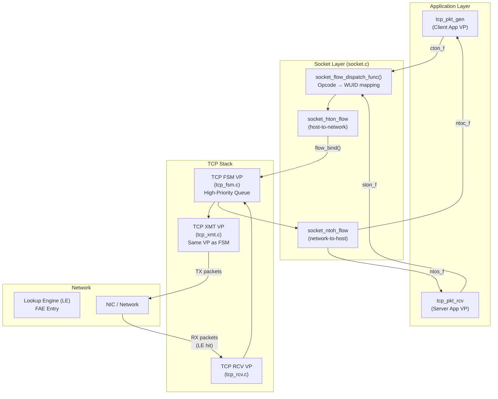
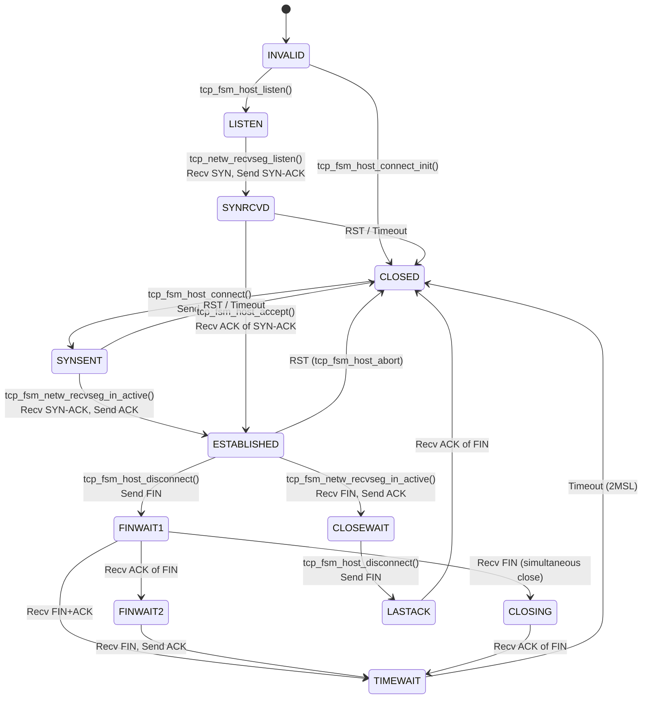
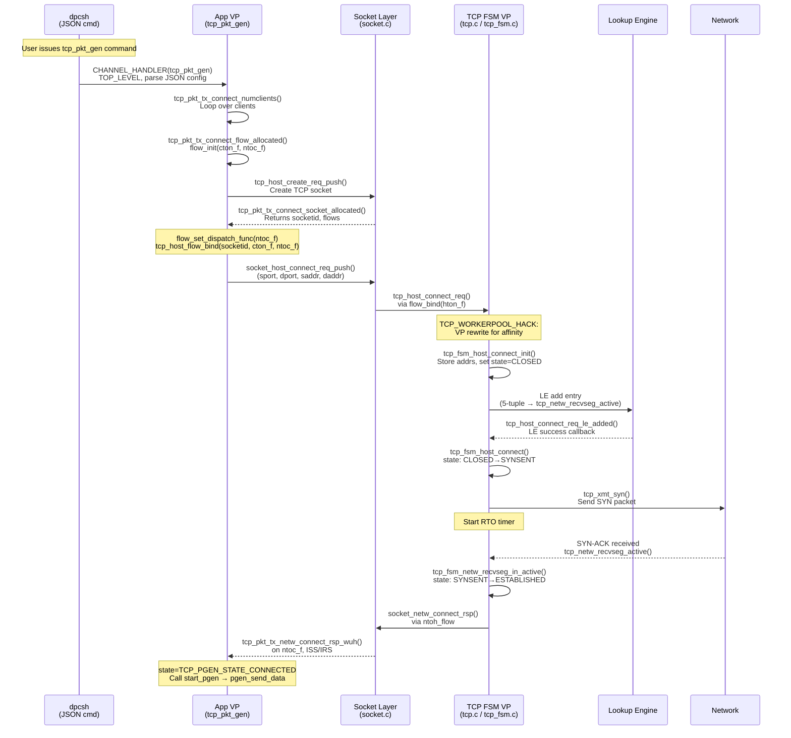
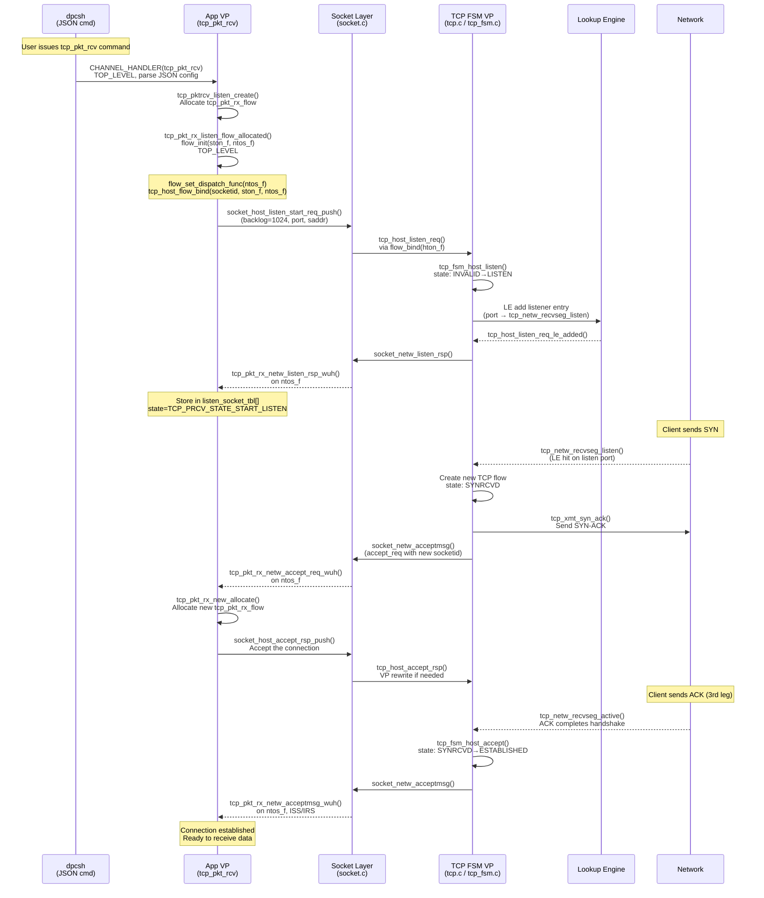
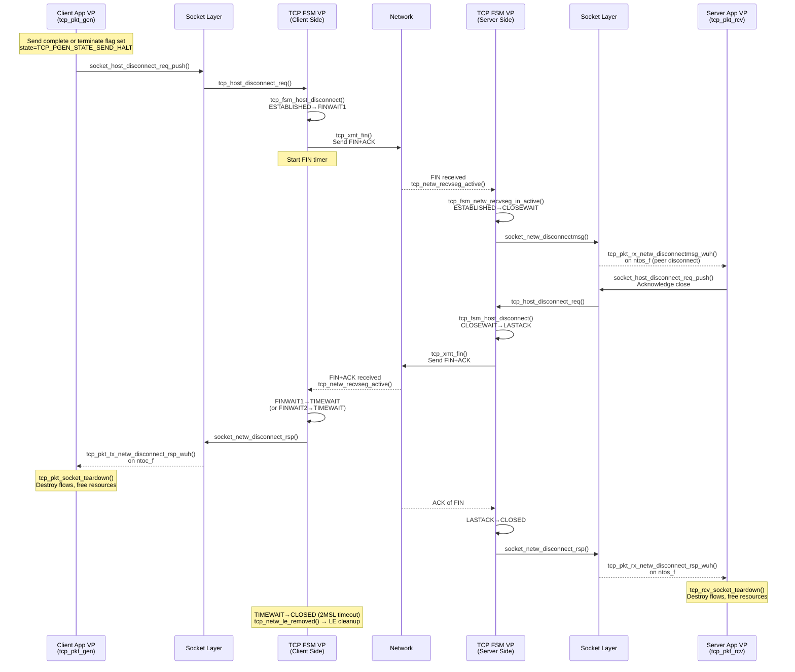
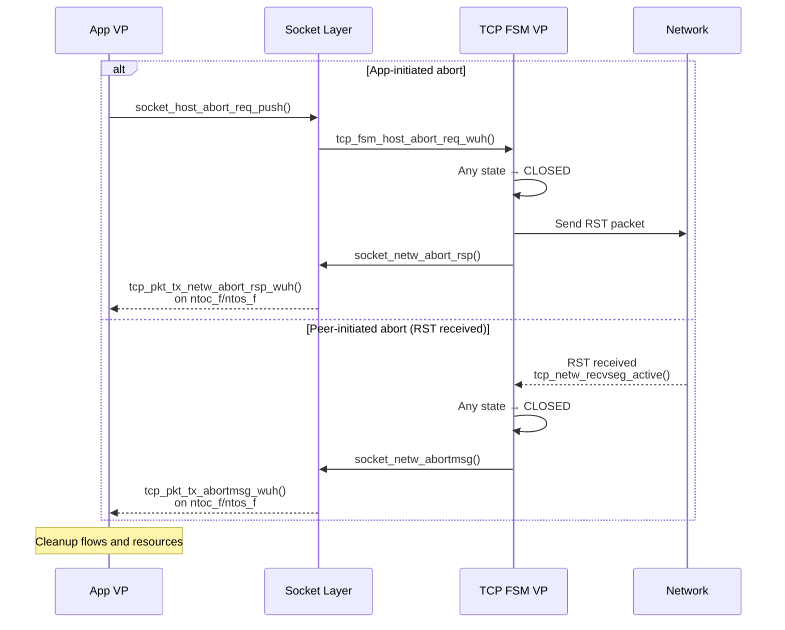
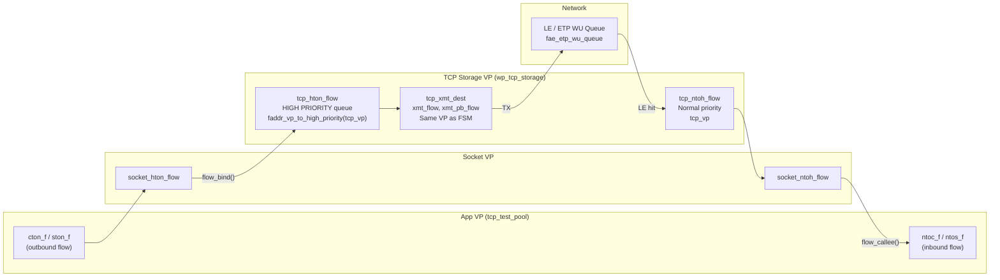
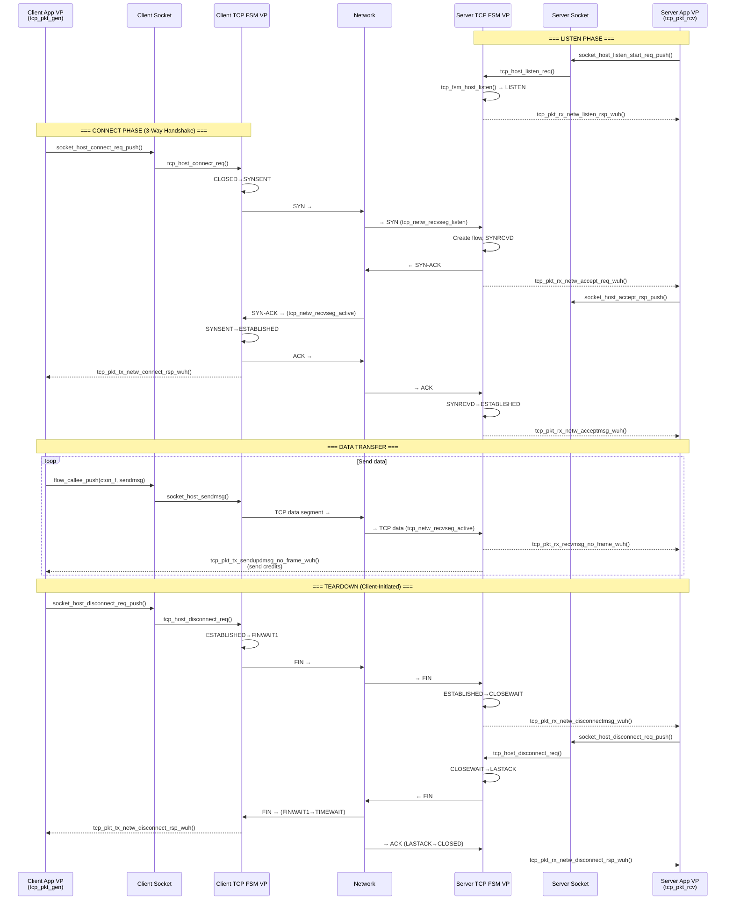

# FunOS TCP Control Path Analysis

## Overview

This document analyzes the TCP control path in FunOS for both client and server sides, including
interactions with the application layer (`tcp_pkt_gen.c` client and `tcp_pkt_rcv.c` server).
It covers Work Unit (WU) handlers, flow directions, VP queue assignments, and the complete
connection establishment and teardown sequences.

---

## Architecture: VP Layers and Flow Directions

FunOS TCP uses a **multi-VP architecture** with bidirectional flows connecting the application
layer to the TCP stack. Each socket connection has a flow pair:

| Side   | Outbound Flow (App→TCP) | Inbound Flow (TCP→App) |
|--------|-------------------------|------------------------|
| Client | `cton_f` (client-to-network) | `ntoc_f` (network-to-client) |
| Server | `ston_f` (server-to-network) | `ntos_f` (network-to-server) |

TCP internally uses a 3-VP model per connection:
- **FSM/Entry VP** — handles socket API entry and FSM transitions (high-priority queue)
- **XMT VP** — handles packet transmission (same VP as FSM for efficiency)
- **RCV VP** — handles packet reception from the network



---

## TCP State Machine

The TCP FSM (`tcp_fsm.c`) defines 13 states:

```c
enum tcp_state {
    TCP_FSM_STATE_INVALID,       // 0 - Initial
    TCP_FSM_STATE_ACCEPT,        // 1 - Pending accept
    TCP_FSM_STATE_CLOSED,        // 2 - Closed
    TCP_FSM_STATE_LISTEN,        // 3 - Listening
    TCP_FSM_STATE_SYNSENT,       // 4 - SYN sent (active open)
    TCP_FSM_STATE_SYNRCVD,       // 5 - SYN received (passive open)
    TCP_FSM_STATE_CLOSING,       // 6 - Both sides sent FIN
    TCP_FSM_STATE_LASTACK,       // 7 - Waiting for last ACK
    TCP_FSM_STATE_TIMEWAIT,      // 8 - TIME_WAIT
    TCP_FSM_STATE_ESTABLISHED,   // 9 - Established (fast-path start)
    TCP_FSM_STATE_FINWAIT1,      // 10 - FIN sent, awaiting ACK
    TCP_FSM_STATE_FINWAIT2,      // 11 - FIN ACK'd, awaiting peer FIN
    TCP_FSM_STATE_CLOSEWAIT,     // 12 - Received FIN, awaiting app close
};
```



---

## Connection Establishment: Client (Active Open)

### Sequence of WU Handlers



### Key WU Handlers — Client Establishment

| # | WU Handler | File | VP | Direction | Purpose |
|---|-----------|------|----|-----------|---------| 
| 1 | `tcp_pkt_gen` | tcp_pkt_gen.c | App | CHANNEL (TOP_LEVEL) | Entry: parse config, launch connections |
| 2 | `tcp_pkt_tx_connect_flow_allocated` | tcp_pkt_gen.c | App | CHANNEL | Init cton_f/ntoc_f flows |
| 3 | `tcp_pkt_tx_connect_socket_allocated` | tcp_pkt_gen.c | App | CHANNEL | Handle socket creation response |
| 4 | `tcp_host_connect_req` | tcp.c | TCP FSM | WU (App→TCP) | Process connect request |
| 5 | `tcp_fsm_host_connect_init` | tcp_fsm.c | TCP FSM | Internal | Init TCP flow state |
| 6 | `tcp_host_connect_req_le_added` | tcp.c | TCP FSM | WU (LE callback) | LE entry added |
| 7 | `tcp_fsm_host_connect` | tcp_fsm.c | TCP FSM | Internal | CLOSED→SYNSENT, send SYN |
| 8 | `tcp_netw_recvseg_active` | tcp.c | TCP RCV | WU (Net→TCP) | Process SYN-ACK |
| 9 | `tcp_fsm_netw_recvseg_in_active` | tcp_fsm.c | TCP FSM | Internal | SYNSENT→ESTABLISHED |
| 10 | `tcp_pkt_tx_netw_connect_rsp_wuh` | tcp_pkt_gen.c | App | WU (TCP→App) | Connect response on ntoc_f |

---

## Connection Establishment: Server (Passive Open)

### Sequence of WU Handlers



### Key WU Handlers — Server Establishment

| # | WU Handler | File | VP | Direction | Purpose |
|---|-----------|------|----|-----------|---------| 
| 1 | `tcp_pkt_rcv` | tcp_pkt_rcv.c | App | CHANNEL (TOP_LEVEL) | Entry: parse config |
| 2 | `tcp_pkt_rx_listen_flow_allocated` | tcp_pkt_rcv.c | App | CHANNEL (TOP_LEVEL) | Init ston_f/ntos_f |
| 3 | `tcp_host_listen_req` | tcp.c | TCP FSM | WU (App→TCP) | Process listen request |
| 4 | `tcp_fsm_host_listen` | tcp_fsm.c | TCP FSM | Internal | Set state=LISTEN |
| 5 | `tcp_host_listen_req_le_added` | tcp.c | TCP FSM | WU (LE callback) | LE listener registered |
| 6 | `tcp_pkt_rx_netw_listen_rsp_wuh` | tcp_pkt_rcv.c | App | WU (TCP→App) | Listen ack on ntos_f |
| 7 | `tcp_netw_recvseg_listen` | tcp.c | TCP RCV | WU (Net→TCP) | SYN received, create new flow |
| 8 | `tcp_pkt_rx_netw_accept_req_wuh` | tcp_pkt_rcv.c | App | WU (TCP→App) | Accept request on ntos_f |
| 9 | `tcp_host_accept_rsp` | tcp.c | TCP FSM | WU (App→TCP) | App accepts connection |
| 10 | `tcp_pkt_rx_netw_acceptmsg_wuh` | tcp_pkt_rcv.c | App | WU (TCP→App) | Connection established |

---

## Connection Teardown: Client-Initiated Close



### Key WU Handlers — Teardown

| # | WU Handler | File | VP | Direction | Purpose |
|---|-----------|------|----|-----------|---------| 
| 1 | `tcp_host_disconnect_req` | tcp.c | TCP FSM | WU (App→TCP) | Process disconnect |
| 2 | `tcp_fsm_host_disconnect` | tcp_fsm.c | TCP FSM | Internal | ESTABLISHED→FINWAIT1 or CLOSEWAIT→LASTACK |
| 3 | `tcp_fsm_netw_fini_disconnectmsg_send` | tcp_fsm.c | TCP FSM | Internal | Send FIN packet |
| 4 | `tcp_pkt_tx_netw_disconnect_rsp_wuh` | tcp_pkt_gen.c | App (Client) | WU (TCP→App) | Disconnect response |
| 5 | `tcp_pkt_tx_netw_disconnectmsg_wuh` | tcp_pkt_gen.c | App (Client) | WU (TCP→App) | Peer disconnect notify |
| 6 | `tcp_pkt_rx_netw_disconnectmsg_wuh` | tcp_pkt_rcv.c | App (Server) | CHANNEL (TCP→App) | Peer disconnect on ntos_f |
| 7 | `tcp_pkt_rx_netw_disconnect_rsp_wuh` | tcp_pkt_rcv.c | App (Server) | WU (TCP→App) | Disconnect ack |
| 8 | `tcp_netw_le_removed` | tcp.c | TCP FSM | WU (LE callback) | LE entry removed |
| 9 | `tcp_pkt_socket_teardown` | tcp_pkt_gen.c | App (Client) | CHANNEL | Socket cleanup |
| 10 | `tcp_rcv_socket_teardown` | tcp_pkt_rcv.c | App (Server) | CHANNEL | Socket cleanup |

---

## Abort Path (RST)



---

## VP Queue Architecture

### Workerpool Registration

```
┌─────────────────────────────────────────────────────────────────┐
│                      WORKERPOOL HIERARCHY                       │
├─────────────────────────────────────────────────────────────────┤
│                                                                 │
│  App Layer Workerpools (tcp_pkt_gen.c / tcp_pkt_rcv.c):         │
│  ┌───────────────────────────────────────────────────────────┐  │
│  │  tcp_test_pool          (100 VPs, default)                │  │
│  │  tcp_prcv_random_pool   (100 VPs, random assignment)      │  │
│  │  Size: TCP_PKT_TX_RX_WP_RSRC_POOL = 100 (silicon)        │  │
│  │                                       48 (POSIX/S1)       │  │
│  └───────────────────────────────────────────────────────────┘  │
│                                                                 │
│  TCP Stack Workerpools (tcp.c):                                 │
│  ┌───────────────────────────────────────────────────────────┐  │
│  │  wp_tcp_storage[cluster]     (per-cluster, round-robin)   │  │
│  │  wp_tcp_tls_storage[cluster] (per-cluster, TLS mode)      │  │
│  │  Flags: WP_SIZE_ANY, WP_FLAG_SHRINK                       │  │
│  └───────────────────────────────────────────────────────────┘  │
│                                                                 │
└─────────────────────────────────────────────────────────────────┘
```

### VP Assignment Modes for App Flows

The client app (`tcp_pkt_gen`) supports three workerpool modes:

| Mode | Assignment Strategy | Code |
|------|-------------------|------|
| **TG_STATIC_WP** | Fixed VP based on socket index: `FADDR(GID_PC(pc), LID_VP(core, vp), 0)` | Deterministic, per-chip formula |
| **TG_RANDOM_WP** | Random VP: `WP_ANY(tcp_prcv_random_pool)` | Load-balanced |
| **TG_DEFAULT_TEST_WP** | Round-robin: `WP_GET(tcp_test_pool, idx % count)` | Default mode |

### TCP VP Assignment and Queue Priority



Key points:
- **HTON flow** (App→TCP) uses **high-priority VP queue** via `faddr_vp_to_high_priority(tcp_vp)` — ensures control messages (connect, disconnect) preempt data path
- **NTOH flow** (Net→TCP) uses normal priority on the same TCP storage VP
- **XMT VP** is the same as the FSM VP (`*xmt_vp = *tcp_vp`) for zero-copy efficiency
- VP assignment is **round-robin per cluster**: `atomic_fetch_add(&tcp_storage_rr[cluster], 1)`

---

## App-to-TCP WU Handler Dispatch

Both apps register a **dispatch function** on their inbound flow (`ntoc_f` / `ntos_f`) that maps
TCP socket opcodes to local WU handlers:

### Client Dispatch Table (`tcp_pkt_gen_module_init`)

```c
socket_req[FUN_SOCKET_OP_CONNECT]       = WUID(tcp_pkt_tx_netw_connect_rsp_wuh);
socket_req[FUN_SOCKET_OP_DISCONNECT]    = WUID(tcp_pkt_tx_netw_disconnect_rsp_wuh);
socket_req[FUN_SOCKET_OP_DISCONNECTMSG] = WUID(tcp_pkt_tx_netw_disconnectmsg_wuh);
socket_req[FUN_SOCKET_OP_ABORT]         = WUID(tcp_pkt_tx_netw_abort_rsp_wuh);
socket_req[FUN_SOCKET_OP_ABORTMSG]      = WUID(tcp_pkt_tx_abortmsg_wuh);
socket_req[FUN_SOCKET_OP_RECVMSG]       = WUID(tcp_pkt_tx_recvmsg_no_frame_wuh);
socket_req[FUN_SOCKET_OP_SENDUPDMSG]    = WUID(tcp_pkt_tx_sendupdmsg_no_frame_wuh);
socket_req[FUN_SOCKET_OP_RRECVMSG]      = WUID(tcp_pkt_tx_rrecvmsg_wuh);
socket_req[FUN_SOCKET_OP_TLS_UPGRADE]   = WUID(tcp_pkt_tx_netw_tls_upgrade_rsp_wuh);
```

### Server Dispatch Table (`tcp_pkt_rcv_module_init`)

```c
socket_req[FUN_SOCKET_OP_LISTEN]        = WUID(tcp_pkt_rx_netw_listen_rsp_wuh);
socket_req[FUN_SOCKET_OP_ACCEPT]        = WUID(tcp_pkt_rx_netw_accept_req_wuh);
socket_req[FUN_SOCKET_OP_ACCEPTMSG]     = WUID(tcp_pkt_rx_netw_acceptmsg_wuh);
socket_req[FUN_SOCKET_OP_CONNECT]       = WUID(tcp_pkt_rx_netw_connect_rsp_wuh);
socket_req[FUN_SOCKET_OP_DISCONNECT]    = WUID(tcp_pkt_rx_netw_disconnect_rsp_wuh);
socket_req[FUN_SOCKET_OP_DISCONNECTMSG] = WUID(tcp_pkt_rx_netw_disconnectmsg_wuh);
socket_req[FUN_SOCKET_OP_ABORT]         = WUID(tcp_pkt_rx_netw_abort_rsp_wuh);
socket_req[FUN_SOCKET_OP_ABORTMSG]      = WUID(tcp_pkt_rx_netw_abortmsg_wuh);
socket_req[FUN_SOCKET_OP_RECVMSG]       = WUID(tcp_pkt_rx_recvmsg_no_frame_wuh);
socket_req[FUN_SOCKET_OP_SENDUPDMSG]    = WUID(tcp_pkt_rx_sendupdmsg_no_frame_wuh);
socket_req[FUN_SOCKET_OP_RRECVMSG]      = WUID(tcp_pkt_rx_rrecvmsg_wuh);
```

---

## Complete Client–Server Interaction



---

## TCP Flow Internal Structure

The `struct tcp_flow` (`tcp_internal.h`) contains the complete per-connection state:

```
┌──────────────────────────────────────────────────────────┐
│                    struct tcp_flow                        │
├──────────────────────────────────────────────────────────┤
│  tcp_hton_flow        (FLOW_ALIGN_SIZE)  App→TCP         │
│  tcp_ntoh_flow        (FLOW_ALIGN_SIZE)  TCP→App         │
│  tcp_flow_timer       Timer management                   │
├──────────────────────────────────────────────────────────┤
│  tcp_state            FSM state (enum tcp_state)         │
│  tcp_timer_type       RXMT/PERSIST/KEEPALIVE/etc.        │
│  tcp_sport, tcp_dport Source/dest ports                   │
│  tcp_saddr, tcp_daddr Source/dest addresses               │
├──────────────────────────────────────────────────────────┤
│  tcp_iss              Initial send sequence               │
│  tcp_irs              Initial receive sequence            │
│  tcp_snd_una          Send unacknowledged                 │
│  tcp_snd_lst          Send last/next                      │
│  tcp_snd_max          Maximum sent                        │
│  tcp_rcv_nxt          Receive next expected               │
│  tcp_rcv_wnd          Receive window                      │
├──────────────────────────────────────────────────────────┤
│  tcp_xmt_dest         XMT VP fabric address               │
│  wuqueue              ETP WU queue info                   │
├──────────────────────────────────────────────────────────┤
│  tcp_xmt              (ALIGNED 256) Transmit state        │
│  tcp_rcv              (ALIGNED 256) Receive state         │
└──────────────────────────────────────────────────────────┘
```

### Timer Types

| Timer | Purpose | Triggered By |
|-------|---------|-------------|
| `TCP_FSM_TIMER_TYPE_RXMT` | Retransmission timeout | SYN/FIN/data not ACK'd |
| `TCP_FSM_TIMER_TYPE_PERSIST` | Zero window probe | Receiver window = 0 |
| `TCP_FSM_TIMER_TYPE_KEEPALIVE` | Keep-alive probe | Idle connection |
| `TCP_FSM_TIMER_TYPE_FINWAIT2` | FIN-WAIT-2 timeout | In FINWAIT2 state |
| `TCP_FSM_TIMER_TYPE_TIMEWAIT` | TIME-WAIT (2MSL) | In TIMEWAIT state |

---

## Summary

### WU Handler Count by Category

| Category | Client (tcp_pkt_gen) | Server (tcp_pkt_rcv) | TCP Stack |
|----------|---------------------|---------------------|-----------|
| Establishment | 3 WU + 5 CHANNEL | 4 WU + 4 CHANNEL | 6 WU |
| Teardown | 3 WU + 1 CHANNEL | 2 WU + 2 CHANNEL | 4 WU |
| Data Path | 4 WU | 3 WU | 2 WU |
| Timers | 2 WU | 1 WU | 5 types |

### Flow Direction Summary

```
Client App                    TCP Stack                    Server App
    │                            │                            │
    ├──cton_f──→ socket_hton ──→ tcp_hton (HP) ──→ XMT ──→ NET
    │                            │                            │
    ←──ntoc_f──← socket_ntoh ←── tcp_ntoh ←────── RCV ←── NET
    │                            │                            │
    │                      NET ──→ tcp_ntoh (HP) ──→ tcp_hton│
    │                            │                            │
    │                      NET ←── XMT ←── tcp_hton ←── ston_f
    │                            │                    ntos_f──┤
```

### Key Design Patterns

1. **Flow binding** bridges VP boundaries: `flow_bind(app_flow, tcp_flow)` connects app and TCP VPs
2. **Dispatch functions** (`tcp_pkt_tx_ntoc_dispatch_func`) map opcodes to WU handlers on the inbound flow
3. **High-priority queue** for control path: HTON flow dest uses `faddr_vp_to_high_priority(tcp_vp)`
4. **Round-robin VP assignment** across clusters for TCP storage VPs
5. **Channel handlers** (TOP_LEVEL) for threaded init sequences; WU handlers for async message processing
