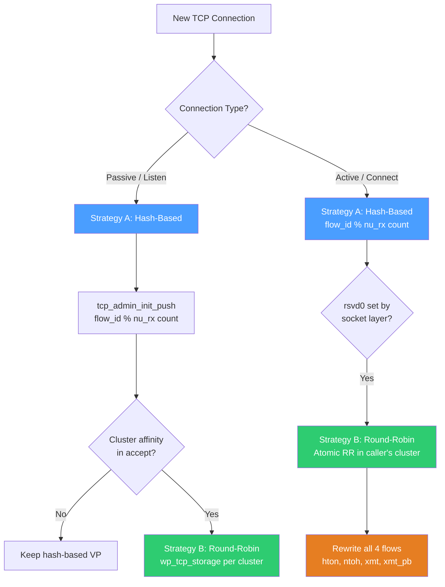
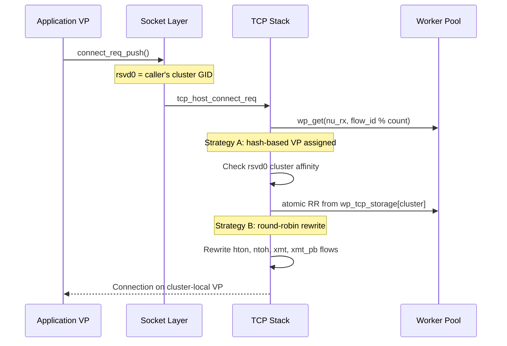

# TCP VP Selection from Worker Pool

## Overview

When new TCP connections are created in FunOS, VPs (Virtual Processors) are selected from the TCP worker pool using two strategies: hash-based default selection and cluster-affine round-robin rewrite.

---

## VP Selection Flow





---

## Two VP Selection Strategies

### Strategy A: Hash-Based (Default)

**`tcp_admin_init_push()`** — `tcp.c:3313`

```c
tcp_vp = wp_get(nu_rx, flow_id(hton_f) % nu_rx->count);
xmt_vp = tcp_vp;
```

- Uses **flow_id modulo NU Rx workerpool count**
- Source pool: `fwd_get_nu_rx_wp()`
- Both TCP and XMT VPs are set to the same VP
- Used for **all initial flow creation** (listen sockets, new accepted connections, connect requests)

### Strategy B: Round-Robin with Cluster Affinity

**`_tcp_storage_vps()`** — `tcp.c:231-242`

```c
uint32_t rr_idx = atomic_fetch_add(&tcp_storage_rr[cluster], 1);
*tcp_vp = wp_get_wrapped(wp_tcp_storage[cluster], rr_idx);
```

- **Atomic per-cluster round-robin counter** ensures even distribution
- Picks from `wp_tcp_storage` (or `wp_tcp_tls_storage` if TLS configured)
- Triggered when application specifies cluster affinity via `rsvd0` field (`TCP_WORKERPOOL_HACK`)

---

## Worker Pool Structure

- **Two workerpools per cluster**: `wp_tcp_storage` and `wp_tcp_tls_storage` (indexed by `TOPO_MAX_CLUSTERS`)
- **Per-cluster round-robin counter**: `atomic_uint tcp_storage_rr[TOPO_MAX_CLUSTERS]` (`tcp.c:229`)
- **Two types of VPs assigned per connection**: TCP VP (FSM) and XMT VP (transmit)

---

## Incoming Connections (Passive Open)

| Stage | Handler | VP Selection | Strategy |
|-------|---------|--------------|----------|
| Socket Create | `socket_create` | None yet | N/A |
| TCP Flow Alloc | `tcp_admin_init_push` | `flow_id % nu_rx->count` | A |
| Listen Start | `tcp_host_listen_req` | Uses alloc VP | Inherited |
| SYN Arrives | `tcp_netw_recvseg_listen` | Processed on listen VP | Inherited |
| Accept New Conn | `tcp_netw_create_req` | New flow → Strategy A | A |
| Optional Rewrite | `tcp_host_accept_rewrite` | If cluster specified → Strategy B | B |

---

## Outgoing Connections (Active Open)

### Step 1: Initial VP — Hash-Based (`tcp_admin_init_push`)

When the socket/flow is first created, it gets a default VP via:

```c
tcp_vp = wp_get(nu_rx, flow_id(hton_f) % nu_rx->count);
```

### Step 2: Connect Request — Cluster Affinity Rewrite

**a) The caller embeds its cluster ID** in `tcp_host_connect_req_push()` (`tcp.c:1754`):

```c
req->rsvd0 = cpu_to_be16(FADDR_GET_GID(vplocal_faddr()));
```

This stores the **caller's cluster (GID)** in the request, so the connection will be pinned to the same cluster as the requesting VP.

**b) The connect handler rewrites VPs** (`tcp.c:1050-1064`):

```c
if (flow_is_metaflow_default(hton_f) &&
    (rsvd0 != TCP_WORKERPOOL_HACK_REWRITTEN)) {
    cluster = be16_to_cpu(connect_req->rsvd0);
    tcp_storage_vps(cluster, &tcp_vp, &xmt_vp, ...);
    tcp_storage_vps_rewrite(tcp_f, tcp_vp, xmt_vp);
}
```

`_tcp_storage_vps()` does **atomic round-robin** within that cluster's storage workerpool.

### Step 3: All Flows Rewritten

`tcp_storage_vps_rewrite()` (`tcp.c:262-284`) updates **hton, ntoh, xmt, and xmt_pb flows** to the new VP. Subsequent WUs are dispatched to `flow_dest(hton_f)` — the rewritten VP.

### Outgoing Summary

| Phase | Mechanism | Code |
|-------|-----------|------|
| Flow creation | `flow_id % nu_rx->count` (hash) | `tcp.c:3313` |
| Connect request | Caller's cluster stored in `rsvd0` | `tcp.c:1754` |
| VP rewrite | Atomic RR from `wp_tcp_storage[cluster]` | `tcp.c:1062` → `tcp.c:234` |
| Flow update | All 4 flows rewritten to new VP | `tcp.c:262-284` |

For outgoing connections: the initial hash-based VP is **overridden** by round-robin selection within the **caller's cluster** storage workerpool, ensuring cluster-local affinity with even distribution.

---

## Connection Migration

When migrating a connection between clusters (`tcp_admin_migrate`, `tcp.c:3554-3608`):

```c
cluster_t cluster = FADDR_GET_GID(fun_admin_tcp_migrate_req_get_dest(admin.req));
tcp_storage_vps(cluster, &tcp_vp, &xmt_vp, flow_id(hton_f));
```

Uses Strategy B (round-robin) from the **destination cluster's** storage workerpool.

---

## Full Strategy Selection Matrix

| Scenario | Selection Mechanism | Algorithm | Workerpool | Location |
|----------|-------------------|-----------|------------|----------|
| Initial Flow Creation | Hash-based | `flow_id % nu_rx->count` | NU Rx workerpool | `tcp.c:3313` |
| Accept with Cluster Affinity | Round-robin | Atomic RR counter + wrap | Storage workerpool | `tcp.c:854` |
| Connect with Cluster Affinity | Round-robin | Atomic RR counter + wrap | Storage workerpool | `tcp.c:1062` |
| Flow Migration | Round-robin | Atomic RR counter + wrap | Storage workerpool (dest) | `tcp.c:3596` |
| Incoming SYN on Listen | Inherited | No re-selection | Listen socket's VP | `tcp.c:3008` |

---

## FunTCP Application API

**Header:** `sdk_include/FunOS/networking/tcpip/tcp.h`

### Connection Lifecycle APIs

#### Create TCP Socket
```c
struct fun_admin_tcp_req *tcp_host_create_tcp_req_init(struct channel *channel);
void tcp_host_create_req_push(struct channel *channel,
                              struct fun_admin_tcp_req *req,
                              enum fun_socket_domain domain);
```

#### Bind Application Flows
```c
void tcp_host_flow_bind(uint32_t tcpid, struct flow *hton_f, struct flow *ntoh_f);
void tcp_host_flow_unbind(uint32_t tcpid, struct flow *hton_f, struct flow *ntoh_f);
```

#### Listen / Accept
```c
void tcp_host_listen_start_req_push(struct channel *channel, uint32_t backlog,
                                    uint16_t sport, struct fun_socket_addr *saddr);
void tcp_host_accept_rsp_push(struct channel *channel, uint32_t listen_id);
```

#### Connect (Outgoing)
```c
void tcp_host_connect_req_push(struct channel *channel, uint16_t sport,
                               uint16_t dport,
                               struct fun_socket_addr *saddr,
                               struct fun_socket_addr *daddr);
```

#### Query Worker Pool
```c
struct workerpool **tcp_get_active_wp(void);  // array indexed by cluster
```

### How Cluster Affinity Is Set (Automatic)

Applications **don't explicitly set affinity** — the socket layer does it transparently. In both `socket_host_connect_req_push()` and `_socket_host_accept_rsp_push()` (`socket.c`):

```c
#if TCP_WORKERPOOL_HACK
    req->rsvd0 = cpu_to_be16(FADDR_GET_GID(vplocal_faddr()));
#endif
```

The **calling VP's cluster GID** is captured in `rsvd0`. TCP then uses it to round-robin select a VP from that cluster's storage workerpool. Connections are automatically pinned to the cluster of the VP that initiates them.

**Feature flag:** `TCP_WORKERPOOL_HACK` in `networking/tcpip/tcp_socket.h:19`

### Typical Application Sequence

```
1. channel_set_caller_flow(channel, &hton_f)
2. req = tcp_host_create_tcp_req_init(channel)
3. tcp_host_create_req_push(channel, req, FUN_SOCKET_DOMAIN_INET)
   → response gives tcpid
4. tcp_host_flow_bind(tcpid, &hton_f, &ntoh_f)
5. tcp_host_connect_req_push(channel, sport, dport, &saddr, &daddr)
   → rsvd0 auto-filled with caller's cluster
   → TCP rewrites VPs via round-robin in that cluster
6. Data path: tcp_host_sendmsg_req_send() / tcp_host_recvupdmsg_send()
```

---

*Generated from FunOS source analysis — `networking/tcpip/tcp.c`, `socket.c`, `tcp_socket.h`*
